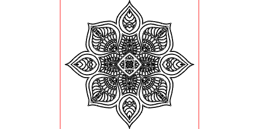

```JavaScript
(await readSvg('https://jsxcad.js.org/svg/visnezh.svg', { fill: false }))
  .by(align('xy'))
  .scale(1 / 100)
  .and(toolpath())
  .gcode('visnezh');
```



[visnezh_0.gcode](visnezh.visnezh_0.gcode)
