```JavaScript
import { NutThread, ScrewThread } from '../bolt/bolt.nb';
```

```JavaScript
import { Gear } from '../gear/gear.js';
```

```JavaScript
import {
  bodyDiameter,
  reelDiameter,
  reelThickness,
  stepperMotor28byj48,
} from '../28BYJ-48/28BYJ-48.nb';
```

```JavaScript
const boardThickness = 8.4;
```

```JavaScript
const screw = ScrewThread(16, 5)
  .cut(
    Box(2, 6)
      .ex(5)
      .rz(0, 1 / 4)
  )
  .stl('screw', { op: rx(1 / 2) });
```

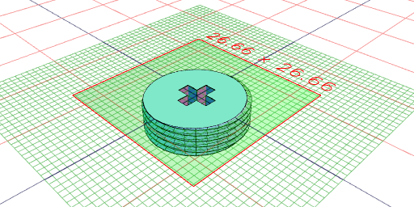

[screw_0.stl](mount.screw_0.stl)

```JavaScript
const upsideClip = Box(30 + 4)
  .align('x>y>')
  .ex(boardThickness + 2, -5)
  .cut(Box(30).align('x>y>').ex(boardThickness))
  .rz(1 / 8)
  .x(2)
  .cut(Box(22).ex(20, -5))
  .cut(Arc(16).ex(-5).x(33))
  .op((s) =>
    Line(21, -21)
      .rz(1 / 4)
      .z(10.5, 0)
      .x(23)
      .hull()
      .op((f) => s.cut(f.ex(-15)).and(f.ex(0.4)))
  )
  .and(NutThread(16, 5).z(-5).x(33))
  .as('clip')
  .view();
```

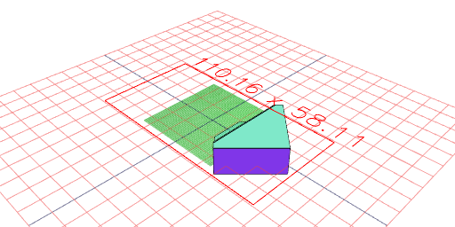

```JavaScript
const upsideProfile = Box(30, 27)
  .clip(
    Arc(bodyDiameter + 2).hull(
      Line((bodyDiameter + 2) / 2, (bodyDiameter + 2) / -2)
        .rz(1 / 4)
        .x(-15)
    )
  )
  .view();
```

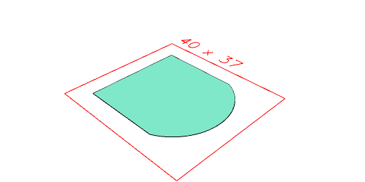

```JavaScript
const toothedReel = Group(
  Arc(reelDiameter + 8)
    .ex(1)
    .z(reelThickness / -2)
    .as('rim')
    .fitTo(Arc(reelDiameter, reelDiameter, reelThickness)),
  Arc(reelDiameter + 4)
    .ex(1)
    .z(reelThickness / 2),
  Gear()
    .hasMmPerTooth(5)
    .hasTeeth(17)
    .ex(2, 1)
    .z(reelThickness / 2)
)
  .as('toothedReel')
  .view({ op: rx(1 / 2) });
```

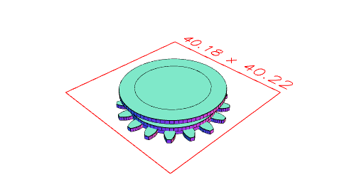

```JavaScript
const upsideBox = upsideProfile
  .ex(20, 9 - 3 + 4)
  .as('box-top')
  .material('glass')
  .and(
    upsideProfile
      .ex(9 - 3 + 4, 2)
      .mask(grow(0.1))
      .as('box-base')
  )
  .fitTo(Box(5, 10).x(-11.5).ex(-3, 20).color('green').as('box-pin'))
  .view();
```

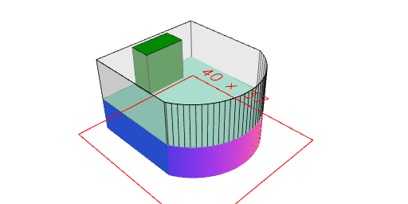

```JavaScript
const upsideDesign = stepperMotor28byj48
  .rx(1 / 2)
  .align('z>')
  .z(2)
  .fit(upsideBox)
  .cutOut(at(get('shaft'), Arc(reelDiameter + 12).ex(2, 11)));
```

```JavaScript
const upsideDesign2 = upsideDesign
  .material('glass')
  .and(
    op((s) =>
      upsideClip
        .rz(1 / 2)
        .rx(1 / 2)
        .z(2 - 5)
        .x(5)
        .fitTo(s.g('box-pin'))
    )
  )
  .on(get('shaft'), fit(toothedReel.z(6)))
  .view()
  .stl('box-top', { op: get('box-top') })
  .stl('box-pin', { op: (s) => s.get('box-pin').ry(1 / 4) })
  .stl('box-base', { op: (s) => s.get('box-base').rx(1 / 2) })
  .stl('reel', {
    op: (s) =>
      s
        .get('toothedReel')
        .n(1) // This is due to the cutOut earlier?
        .on(
          (s) => s.get('rim'),
          (s) => s.color('green').void()
        )
        .material('glass'),
  })
  .stl('rim', { op: (s) => s.get('toothedReel').n(1).get('rim') })
  .stl('clip', {
    op: (s) => s.get('clip').rx(1 / 2),
  });
```

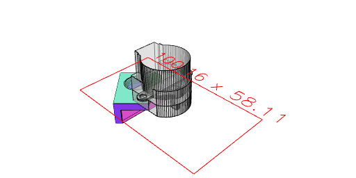

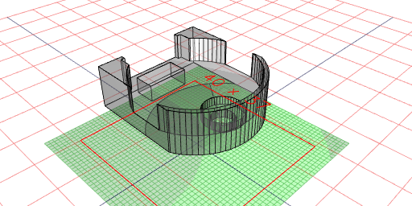

[box-top_0.stl](mount.box-top_0.stl)

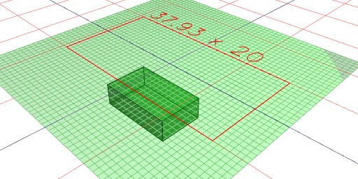

[box-pin_0.stl](mount.box-pin_0.stl)

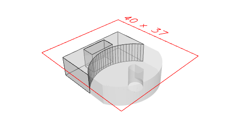

[box-base_0.stl](mount.box-base_0.stl)

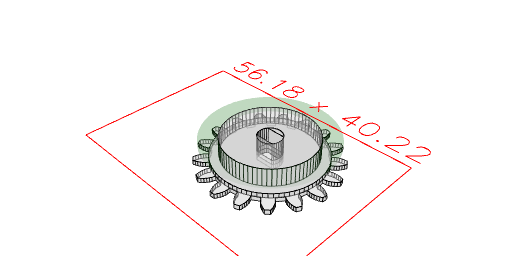

[reel_0.stl](mount.reel_0.stl)

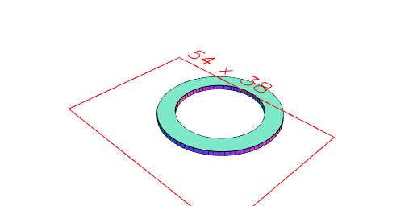

[rim_0.stl](mount.rim_0.stl)

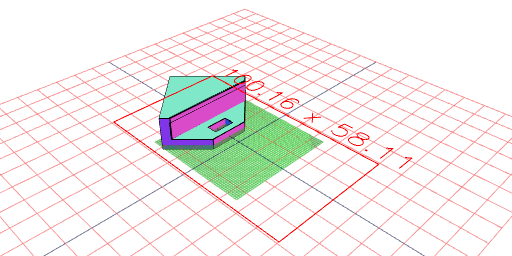

[clip_0.stl](mount.clip_0.stl)
