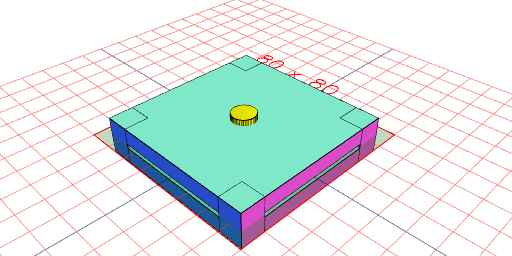
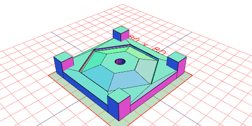
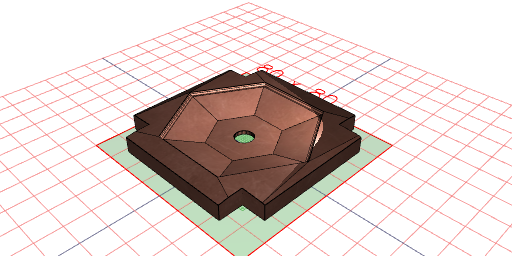
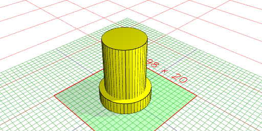

```JavaScript
const profile = Arc(1)
  .hasAngle(0 / 4, 2 / 4)
  .x(10)
  .and(Point(5, -2), Point(0.001, -2), Point(0.001, -1), Point(5, -1))
  .loop()
  .fill()
  .scale(3)
  .view();
```


```JavaScript
const saucer = profile
  .rx(1 / 4)
  .seq({ by: 1 / 6 }, rz, Loft)
  .view(2);
```


```JavaScript
saucer
  .and(
    (s) => s.lowerEnvelope().ez(-1).z(-5),
    (s) => s.upperEnvelope().ez(1).z(5)
  )
  .to(align('z>'))
  .view(1);
```


```JavaScript
const top = saucer
  .upperEnvelope()
  .loft(Box(70).z(1), Box(70).z(7.5))
  .cutout(Arc(8, 8, [-10, 10]), (cut) => (clipped) =>
    cut.and(
      clipped
        .grow(-0.1, 'xy')
        .add(Arc(10, 10, [7.5, 10]))
        .color('yellow')
        .as('peg')
    )
  )
  .and(
    Box([35, 25], [35, 25], [-7.5, 7.5])
      .mask(Box([35.1, 24.9], [35.1, 24.9], [-7.5, 0]))
      .rz(0 / 4, 1 / 4, 2 / 4, 3 / 4)
  )
  .as('top')
  .view(rx(1 / 2));
```


```JavaScript
const base = saucer
  .lowerEnvelope()
  .loft(Box(70).z(-1), Box(70).z(-7.5))
  .cutout(Arc(8, 8, [-10, 10]), (cut) => (clipped) =>
    cut.and(
      clipped
        .grow(-0.1, 'xy')
        .add(Arc(10, 10, [-7.5, -10]))
        .color('yellow')
        .as('peg')
    )
  )
  .as('base')
  .view();
```


```JavaScript
const mold = top.fit(base).view();
```



```JavaScript
mold
  .stl('top', (s) =>
    s
      .get('top')
      .rx(1 / 2)
      .to(align('z>'))
      .on(get('peg'), (s) => Empty())
  )
  .stl('base', (s) =>
    s
      .get('base')
      .to(align('z>'))
      .on(get('peg'), (s) => Empty())
      .material('copper')
  )
  .stl('top-peg', (s) =>
    s
      .get('top')
      .get('peg')
      .rx(1 / 2)
      .to(align('z>'))
  )
  .stl('base-peg', (s) => s.get('base').get('peg').to(align('z>')));
```



[top_0.stl](saucer.top_0.stl)



[base_0.stl](saucer.base_0.stl)



[top-peg_0.stl](saucer.top-peg_0.stl)


[base-peg_0.stl](saucer.base-peg_0.stl)
