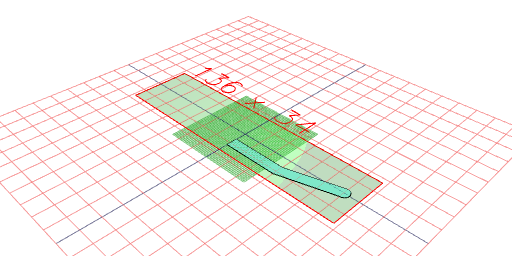
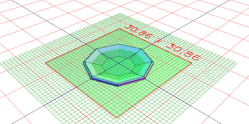
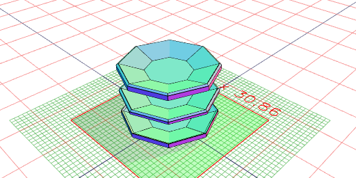
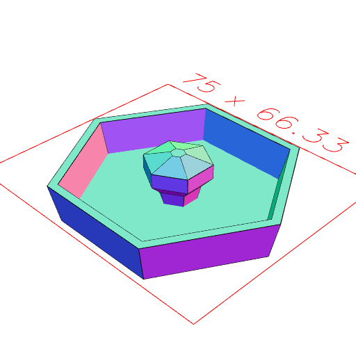
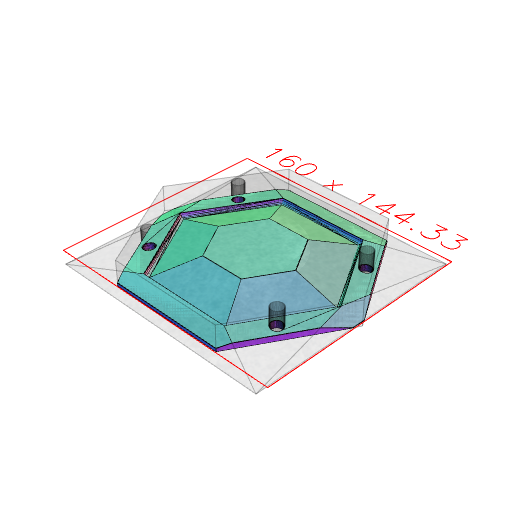

```JavaScript
const profile = Arc(1)
  .hasAngle(0 / 4, 2 / 4)
  .x(10)
  .and(Point(5, -2), Point(0.001, -2), Point(0.001, -1), Point(5, -1))
  .loop()
  .fill()
  .scale(6)
  .view();
```



```JavaScript
const knob = Loft(
  Hexagon(60)
    .rz(1 / 12)
    .z(-6.05),
  Hexagon(65)
    .rz(1 / 12)
    .z(5),
  Hexagon(60)
    .rz(1 / 12)
    .z(5),
  Hexagon(55)
    .rz(1 / 12)
    .z(-4),
  Hexagon(10).z(-4),
  Hexagon(12).z(0),
  Hexagon(18).z(3, 7),
  Hexagon(4).z(9)
)
  .mask(
    Loft(
      Hexagon(60)
        .rz(1 / 12)
        .z(-6.05),
      Hexagon(65)
        .rz(1 / 12)
        .z(5)
    ).grow(0.1, 'xy')
  )
  .as('knob')
  .view();
```



```JavaScript
const saucer = profile
  .rx(1 / 4)
  .seq({ by: 1 / 6 }, rz, Loft)
  .view(2);
```



```JavaScript
const top = saucer
  .upperEnvelope()
  .involute()
  .loft(noOp(), Box(150).z(5))
  .fitTo(knob)
  .as('top')
  .stl('knob', get('knob').by(align('>z')));
```

```JavaScript
const base = saucer.lowerEnvelope().loft(noOp(), Box(150).z(-12.01)).as('base');
```

```JavaScript
const topWithPegHoles = top
  .cut(Arc(8.2).ez(-12, 5).x(50, -50).y(35, -35))
  .clip(
    Hexagon(155)
      .rz(1 / 12)
      .ez(-12, 5)
  )
  .stl(
    'top2',
    getNot('knob')
      .rx(1 / 2)
      .by(align('>z'))
  );
```



[top2_0.stl](saucer.top2_0.stl)

```JavaScript
const baseWithPegHoles = base
  .cut(Arc(8.2).ez(-12, 5).x(50, -50).y(35, -35))
  .clip(
    Hexagon(155)
      .rz(1 / 12)
      .ez(-12)
  )
  .stl('base');
```



[base_0.stl](saucer.base_0.stl)
