```JavaScript
Triangle(10)
  .color('red')
  .add(Box(5).color('blue'))
  .gridView();
```

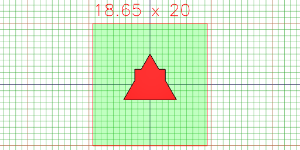

```JavaScript
Box(5)
  .and(Arc(5))
  .gridView(undefined, { size: 800, triangles: false, outline: true, wireframe: false });
```

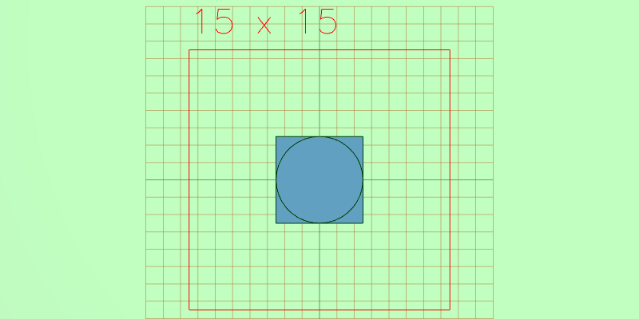

```JavaScript
Triangle(10)
  .color('red')
  .addTo(Box(5).color('blue'))
  .gridView();
```

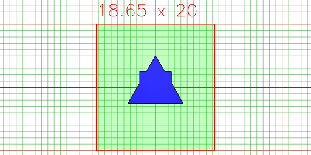

```JavaScript
Box(5).align('x>y>').gridView();
```

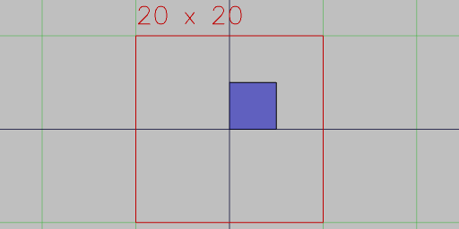

```JavaScript
Box(5)
  .as('box')
  .with(Arc(4).as('arc'))
  .keep('box')
  .gridView();
```

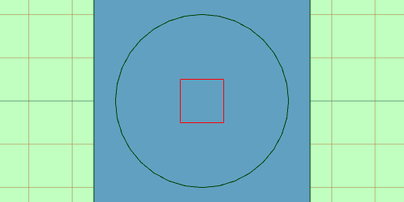

```JavaScript
Box(5)
  .color('red')
  .clip(Arc(5.8).color('blue'))
  .gridView();
```

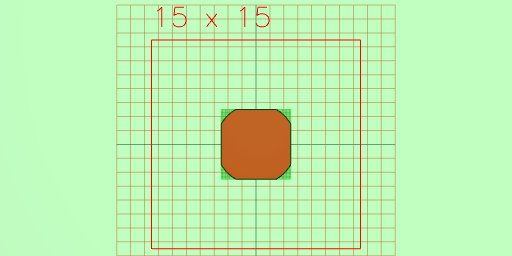

```JavaScript
Box(5)
  .color('red')
  .clipFrom(Arc(5.8).color('blue'))
  .gridView();
```

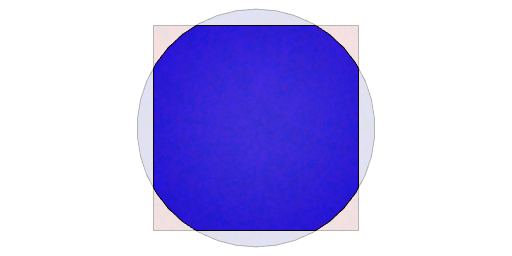

```JavaScript
Box(5).color('green').gridView();
```

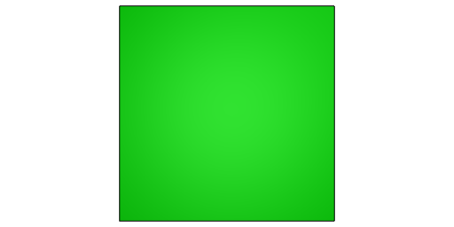

```JavaScript
Box(5)
  .color('green')
  .colors((colors, s) => {
    md`Colors are ${colors}`;
    return s;
  });
```

Colors are

```JavaScript
Box(5)
  .color('red')
  .cut(Arc(6).color('blue'))
  .gridView();
```

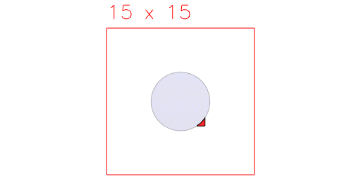

```JavaScript
Box(5)
  .color('red')
  .cutFrom(Arc(6).color('blue'))
  .gridView();
```

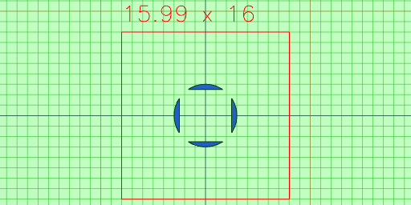

```JavaScript
Assembly(Box(5), Arc(6))
  .each((leafs) => leafs[0])
  .gridView();
```

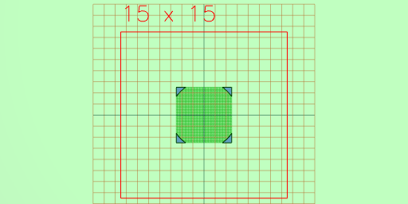

```JavaScript
Group(Box(5).color('red'), Arc(6).color('blue'))
  .fuse()
  .gridView();
```


```JavaScript
Box(10).inset(0.5, 0.5).gridView();
```


```JavaScript
Assembly(Box(10).as('a'), Arc(6).as('b'))
  .keep('a')
  .gridView();
```


```JavaScript
Box(10)
  .material('copper')
  .gridView();
```

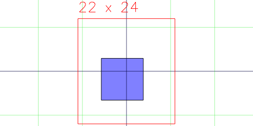

```JavaScript
Box(10).move(1, 2, 3).gridView();
```

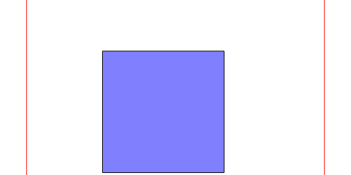

```JavaScript
Box(10).moveTo(1, 2, 3).gridView();
```

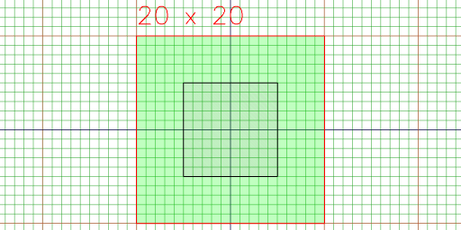

```JavaScript
Box(10).move(1, 2, 3).moveTo(center()).gridView();
```

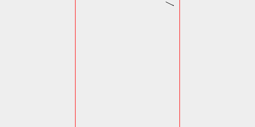

```JavaScript
Box(10).move(top()).gridView();
```

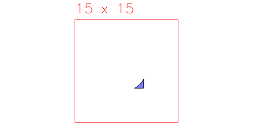

```JavaScript
Assembly(Box(5), Arc(5.5).void())
  .noVoid()
  .gridView();
```

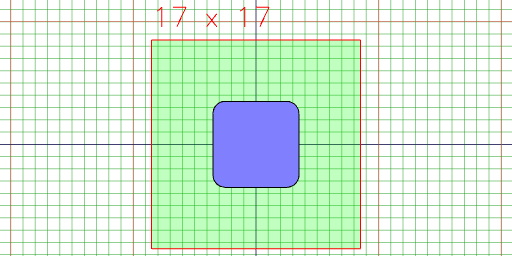

```JavaScript
Box(5).offset(1).gridView();
```

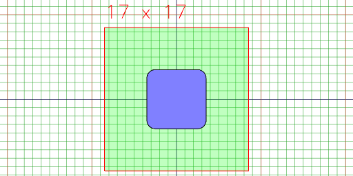

```JavaScript
Box(5)
  .op((s) => s.color('green'))
  .gridView();
```

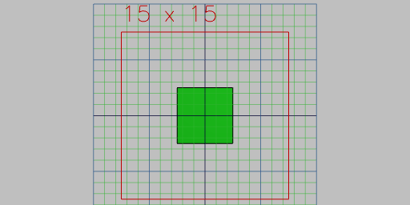

```JavaScript
Line(10)
  .orient({ at: [40, 50, 0] })
  .gridView();
```

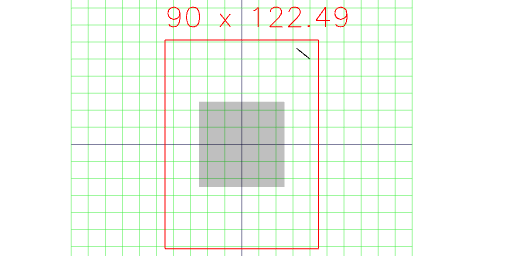

```JavaScript
Group(seq((n) => Arc(n), { from: 1, to: 20 }))
  .pack()
  .gridView();
```

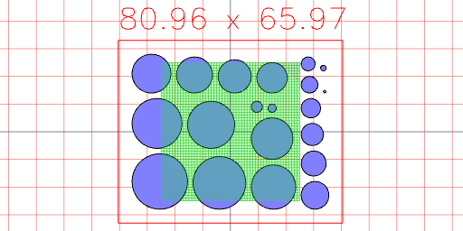

```JavaScript
Box(5).rotate(45).gridView();
```

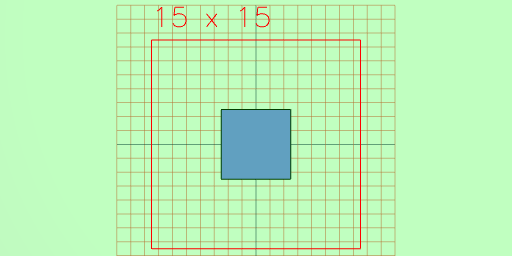

```JavaScript
Box(1, 2, 3).rx(1/8).gridView();
```

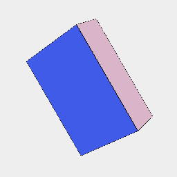

```JavaScript
Box(1, 2, 3).ry(1/8).gridView();
```

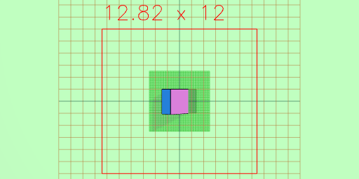

```JavaScript
Box(1, 2, 3).rz(1/8).gridView();
```

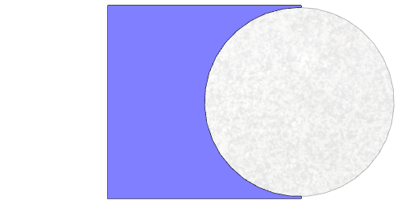

```JavaScript
Box(5).scale(1, 2).gridView();
```

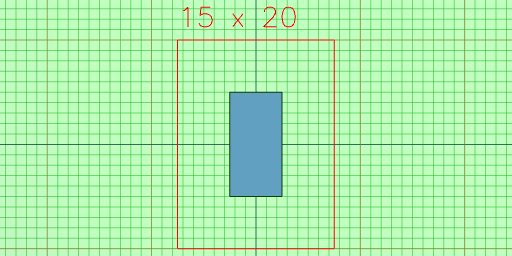

```JavaScript
Box(5).cut(Arc(4.9).align('x>')).scale(1, 1).gridView();
```

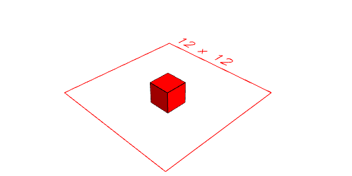

```JavaScript
Box(5).cut(Arc(4.9).align('x>')).scale(-1, 1).gridView();
```

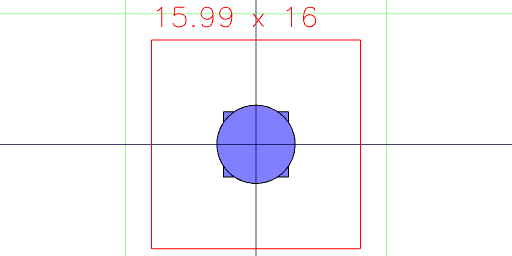

```JavaScript
Box(1, 2, 3)
  .size((size, shape) => {
    md`${JSON.stringify(size)}`;
    return shape;
  });
```

{"length":1.0000000000000027,"width":2.0000000000000053,"height":3.000000000000004,"max":[0.5000000000000001,1.000000000000005,1.5000000000000002],"min":[-0.5000000000000026,-1.0000000000000002,-1.5000000000000038],"center":[-1.2212453270876722e-15,2.4424906541753444e-15,-1.7763568394002505e-15],"radius":1.8708286933869742}

```JavaScript
Box(2, 2, 2)
  .color('red')
  .and(Box(1, 1, 1).sketch())
  .view();
```

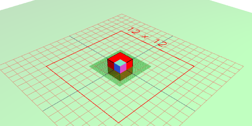

```JavaScript
Box(1)
  .as('box')
  .tags((tags, shape) => {
    md`${tags}`;
    return shape;
  });
```

```JavaScript
Box(5, 5, 5).test().gridView();
```

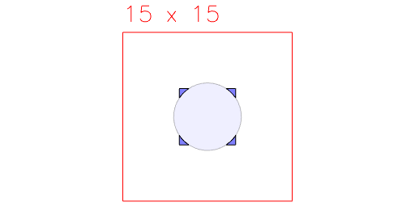

```JavaScript
Box(5).tool('laser').gridView();
```

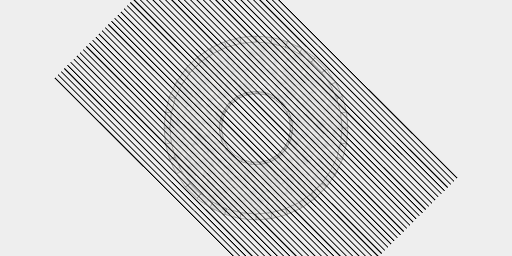

```JavaScript
Assembly(Box(5), Arc(6).void())
  .gridView();
```

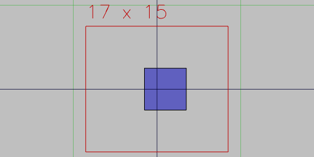

```JavaScript
Weld(Arc(6).x(-1), Arc(6).x(1), Arc(6).y(1), Arc(6).y(-1))
  .fill()
  .gridView();
```

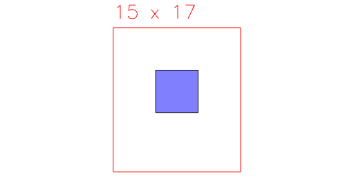

```JavaScript
Box(5).with(Arc(6)).gridView();
```

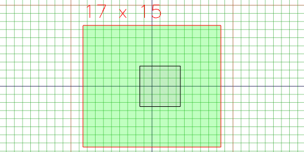

```JavaScript
Box(5).x(1).gridView();
```

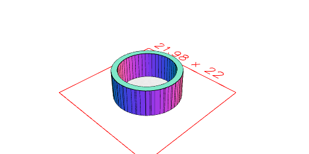

```JavaScript
Box(5).y(1).gridView();
```

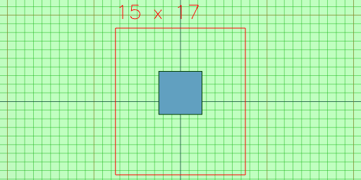

```JavaScript
Box(5).z(1).gridView();
```

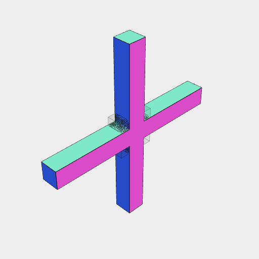

```JavaScript
Arc(10).voidIn(offset(1)).ez(5).view();
```

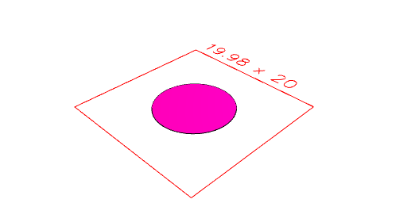

```JavaScript
Box(10)
  .ez(10)
  .color('green')
  .and((s) => s.faces().n(4).extrudeAlong(normal(), 1).tint('red'))
  .view();
```

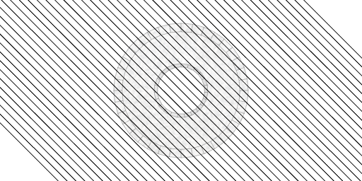

```JavaScript
Arc(10).color('blue').color('red').view();
```

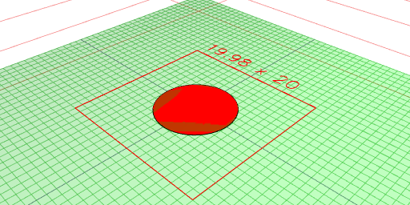

```JavaScript
Arc(10).color('blue').tint('red').view();
```

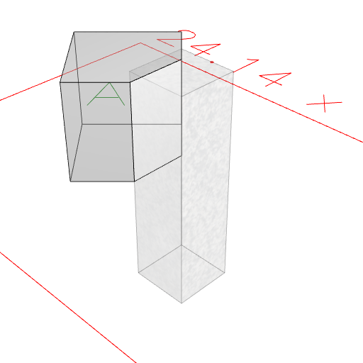

```JavaScript
Edges(
  seq((y) => [Point(-10, y, 0), Point(10, y, 0)], {
    from: -6,
    to: 6,
    by: 1 / 4,
  })
)
  .rz(1 / 8)
  .clip(Arc(5).cut(Arc(2)).ez(1, -1))
  .gridView();
```

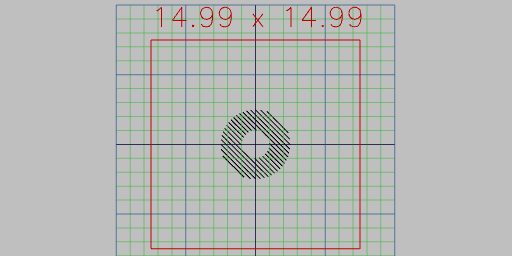

```JavaScript
const topEdge = ([[, , startZ], [, , endZ]]) => Math.min(startZ, endZ);
```

```JavaScript
const leftEdge = ([[startX], [endX]]) => Math.min(startX, endX);
```

```JavaScript
const b = Box(5)
  .ez(5)
  .and(
    Hershey('A', 3)
      .color('green')
      .z(5 / 2)
  )
  .material('glass')
  .y(10);
```

```JavaScript
Voxels([0, 0, 0], [0, 0, 1], [1, 0, 1], [2, 0, 1]).view();
```

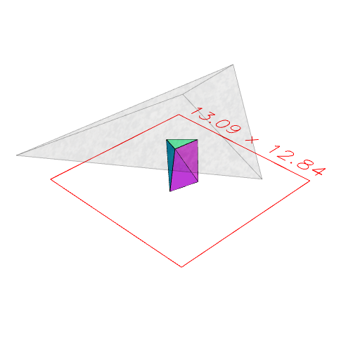

```JavaScript
b.at(
  (s) => s.getEdge(topEdge).getEdge(leftEdge).nth(0),
  cut(Box(11, 3, 3).rx(1 / 8))
)
  .view()
```

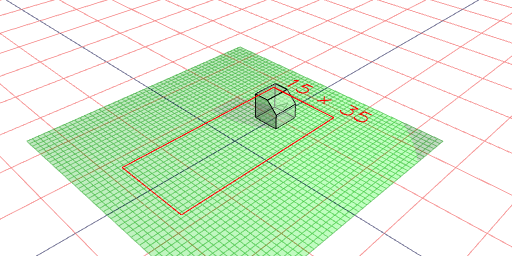

```JavaScript
b.to(
  (s) => s.getEdge(topEdge).getEdge(leftEdge).nth(0),
  cut(Box(11, 3, 3).rx(1 / 8))
)
  .view()
```


```JavaScript
Arc(2)
  .ez(5)
  .cut(Box(5).ry(1 / 16).ez(5).z(3))
  .simplify({ ratio: 0.1, eps: 0.01 })
  .view();
```

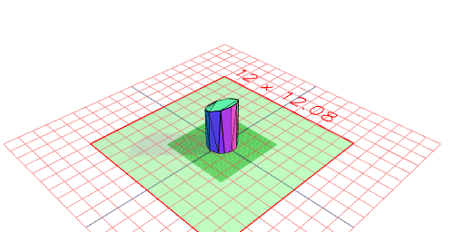

```JavaScript
Triangle(14).svg('triangle');
```


[triangle_0.svg](shape.triangle_0.svg)

```JavaScript
Box(10)
  .ez(50, -50)
  .rx(0, 1 / 4)
  .fuse().view(0)
  .remesh({ method: 'isotropic', iterations: 1, relaxationSteps: 1, targetEdgeLength: 0.5, }, Box(20, 20, 20))
  .smooth({ method: 'shape', iterations: 1, time: 1 }, Box(9, 20, 20))
  .view();
```

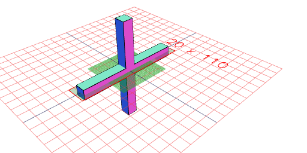

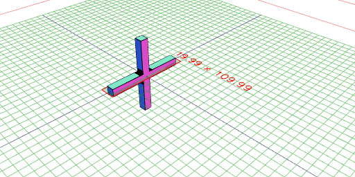

```JavaScript
Box(20, 20, 20)
  .view(1, { wireframe: true })
  .md('Original mesh')
  .remesh()
  .view(2, { wireframe: true })
  .md('Isotropic remeshing')
  .cut(Box([0, 10], [0, -10], [0, 10]))
  .view(3, { wireframe: true })
  .md('Cut')
  .demesh()
  .view(4, { wireframe: true })
  .md('Cleaned mesh');
```

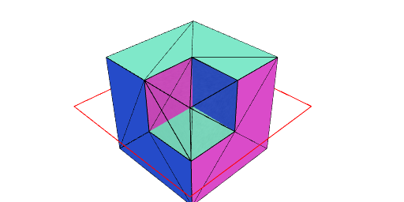

Original mesh

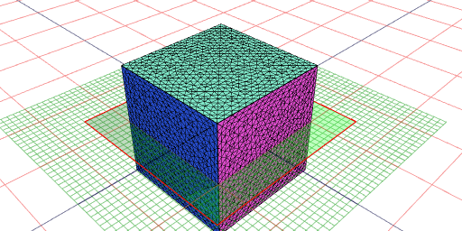

Isotropic remeshing

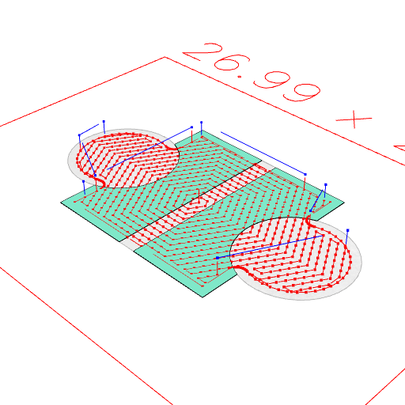

Cut


Cleaned mesh

```JavaScript
Arc(4)
  .x(5)
  .seq({ by: 1 / 8 }, rz, Join)
  .material('glass')
  .color('orange')
  .and(toolpath())
  .view();
```


```JavaScript
Box(10)
  .cut(Arc(6).x(6, -6), Box(1, 10))
  .and(toolpath())
  .view();
```


```JavaScript
Arc(5)
  .x(4)
  .seq({ by: 1 / 8 }, rz, Join)
  .cut(Box(10, 20).y(6))
  .and((s) => s.packingEnvelope().outline().color('red'),
       (s) => s.packingEnvelope({ offset: 1, threshold: 20 }).outline().color('green'))
  .view();
```


```JavaScript
Box(20, 20, 20)
  .join(Box(10, 10, 40))
  .rx(1 / 16)
  .material('glass')
  .and((s) => s.upperEnvelope().color('red'))
  .view();
```


