```JavaScript
await Triangle(10).color('red').add(Box(5).color('blue')).gridView(1);
```

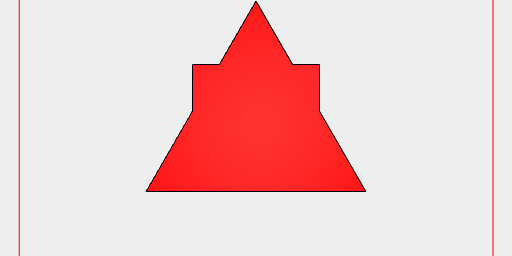

```JavaScript
await Box(5).and(Arc(5)).view(2, 'top', 'noSkin', 'noWireframe', { size: 800 });
```


```JavaScript
await Triangle(10).color('red').addTo(Box(5).color('blue')).gridView(3);
```


```JavaScript
await Box(5).by(align('x>y>')).gridView(4);
```


```JavaScript
await Box(5).as('box').fitTo(Arc(4).as('arc')).drop(getNot('box')).gridView(5);
```

```JavaScript
await Box(5).color('red').clip(Arc(5.8).color('blue')).gridView(6);
```


```JavaScript
await Box(5).color('red').clipFrom(Arc(5.8).color('blue')).gridView(7);
```


```JavaScript
await Box(5).color('green').gridView(8);
```


```JavaScript
await Box(5)
  .color('green')
  .tags('color', (colors) => note(`Colors are ${colors}`));
```

Colors are undefined

```JavaScript
await Box(5).color('red').cut(Arc(6).color('blue')).gridView(9);
```


```JavaScript
await Box(5).color('red').cutFrom(Arc(6).color('blue')).gridView(10);
```


```JavaScript
await Assembly(Box(5), Arc(6))
  .each((leafs) => leafs[0])
  .gridView(11);
```

```JavaScript
await Group(Box(5).color('red'), Arc(6).color('blue')).fuse().gridView(12);
```

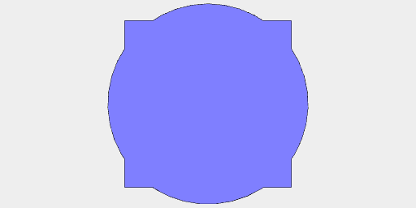

```JavaScript
await Box(10).inset(0.5, { step: 0.5 }).disjoint().n(0, 2, 4, 6, 8).gridView(13);
```


```JavaScript
await Assembly(Box(10).as('a'), Arc(6).as('b')).drop(getNot('a')).gridView(14);
```

```JavaScript
await Box(10).material('copper').gridView(15);
```


```JavaScript
await Box(10).move(1, 2, 3).gridView(16);
```


```JavaScript
await Box(10).to(Point(1, 2, 3)).gridView(17);
```


```JavaScript
await Box(10).move(1, 2, 3).to(center()).gridView(18);
```


```JavaScript
await Box(10, 10, 10).move(faces().sort('z>').n(0)).view(19);
```


```JavaScript
await Assembly(Box(5), Arc(5.5).void()).noVoid().gridView(20);
```

```JavaScript
await Box(5).offset(1).gridView(21);
```

```JavaScript
await Box(5).op(color('green')).gridView(22);
```


```JavaScript
await Line(10)
  .orient({ at: [40, 50, 0] })
  .gridView(23);
```


```JavaScript
await Group(seq(Arc, { from: 1, to: 20 }))
  .pack()
  .gridView(24);
```


```JavaScript
await Box(1, 2, 3)
  .rx(1 / 8)
  .gridView(25);
```


```JavaScript
await Box(1, 2, 3)
  .ry(1 / 8)
  .gridView(26);
```


```JavaScript
await Box(1, 2, 3)
  .rz(1 / 8)
  .gridView(27);
```

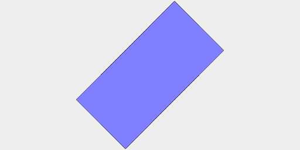

```JavaScript
await Box(5).scale(1, 2).gridView(28);
```


```JavaScript
await Box(5)
  .cut(Arc(4.9).by(align('x>')))
  .scale(1, 1)
  .gridView(29);
```


```JavaScript
await Box(5)
  .cut(Arc(4.9).by(align('x>')))
  .scale(-1, 1)
  .gridView(30);
```


```JavaScript
await Box(1, 2, 3).size((size) => (shape) => shape.md(`${JSON.stringify(size)}`));
```

{"length":1.0000000000000009,"width":2.0000000000000018,"height":3.0000000000000013,"max":[0.5000000000000004,1.0000000000000009,1.5000000000000007],"min":[-0.5000000000000004,-1.0000000000000009,-1.5000000000000007],"center":[0,0,0],"radius":1.8708286933869718}

```JavaScript
await Box(2, 2, 2).color('red').and(Box(1, 1, 1).sketch()).view(31);
```


```JavaScript
await Box(1)
  .as('box')
  .tags((tags) => note(`${tags}`));
```

undefined

```JavaScript
await Box(5, 5, 5).gridView(32);
```


```JavaScript
await Box(5).tool('laser').gridView(33);
```


```JavaScript
await Assembly(Box(5), Arc(6).void()).gridView(34);
```


```JavaScript
await Box(5).fitTo(Arc(6)).gridView(35);
```


```JavaScript
await Box(5).x(1).gridView(36);
```


```JavaScript
await Box(5).y(1).gridView(37);
```


```JavaScript
await Box(5).z(1).gridView(38);
```


```JavaScript
await Arc(10)
  .op((s) => s.offset(1).fitTo(s.void()))
  .ez(5)
  .view(39);
```


```JavaScript
await Box(10)
  .ez(10)
  .color('green')
  .and(faces().n(4).extrudeAlong(normal(), 1).tint('red'))
  .view(40);
```


```JavaScript
await Arc(10).color('blue').color('red').view(41);
```


```JavaScript
await Arc(10).color('blue').tint('red').view(42);
```


```JavaScript
await Edges(
  seq(
    (y) => (s) => [Point(-10, y, 0), Point(10, y, 0)],
    {
      from: -6,
      to: 6,
      by: 1 / 4,
    },
    List
  )
)
  .rz(1 / 8)
  .clip(Arc(5).cut(Arc(2)).ez(1, -1))
  .gridView(43);
```


```JavaScript
const b = await Box(5)
  .ez(5)
  .and(
    Hershey('A', 3)
      .color('green')
      .z(5 / 2)
  )
  .material('glass')
  .y(10);
```

```JavaScript
await b.at(eachEdge().sort('x<y<z>').n(0).origin(), cut(Box(3, 3, 11))).view(44);
```


```JavaScript
await b.by(eachEdge().sort('x<y<z>').n(0).origin()).cut(Box(3, 3, 11)).view(45);
```


```JavaScript
await Voxels([0, 0, 0], [0, 0, 1], [1, 0, 1], [2, 0, 1]).view(46);
```


```JavaScript
await Arc(2)
  .ez(5)
  .cut(
    Box(5)
      .ry(1 / 16)
      .ez(5)
      .z(3)
  )
  .simplify({ ratio: 0.1, eps: 0.01 })
  .view(47);
```

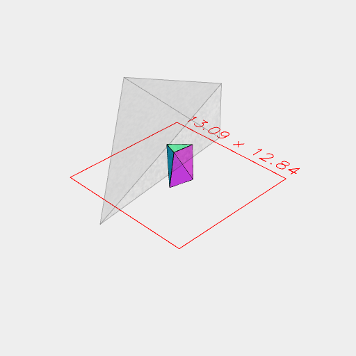

```JavaScript
await Triangle(14).svg('triangle');
```

[triangle_0.svg](shape.triangle_0.svg)


```JavaScript
await Box(10)
  .ez(50, -50)
  .rx(0, 1 / 4)
  .fuse()
  .view(0)
  .remesh(1, Box(20, 20, 20))
  .smooth({ method: 'shape', iterations: 1, time: 1 }, Box(9, 20, 20))
  .view(48);
```


```JavaScript
await Box(20, 20, 20)
  .view(49, 'wireframe')
  .md('Original mesh')
  .remesh()
  .view(50, 'wireframe')
  .md('Isotropic remeshing')
  .cut('exact', Box([0, 10], [0, -10], [0, 10]))
  .view(51, 'wireframe')
  .md('Cut')
  .demesh()
  .view(52, 'wireframe')
  .md('Cleaned mesh');
```


Original mesh


Isotropic remeshing


Cut


Cleaned mesh

```JavaScript
await Arc(4)
  .x(5)
  .seq({ by: 1 / 8 }, rz, Join)
  .material('glass')
  .color('orange')
  .and(toolpath())
  .view(53);
```

```JavaScript
await Box(10).cut(Arc(6).x(6, -6), Box(1, 10)).and(toolpath()).view(54);
```

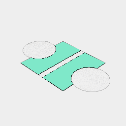

```JavaScript
await Box(20, 20, 20)
  .join(Box(10, 10, 40))
  .rx(1 / 16)
  .material('glass')
  .and(upperEnvelope().color('red'))
  .view(60);
```

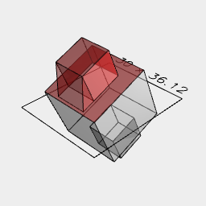

Area of Box(2).cut(Box(1)) is function () { [native code] }

```JavaScript
await Box(2)
  .cut(Box(1))
  .area((v) => (s) => s.md(`Area is ${v.toFixed(2)}`));
```

Area is 4.00

Area of Box(2, 3, 4) is function () { [native code] }

Volume of Box(2, 3, 4) is function () { [native code] }

```JavaScript
const c = await Box(10)
  .rx(1 / 8)
  .view(67);
```


```JavaScript
await c.by(origin()).view(68);
```


```JavaScript
await c.by(origin(), and(Box(5, 5, 5))).view(69);
```


```JavaScript
await c.by(origin(), cut(Box(5, 5, 5))).view(70);
```


```JavaScript
await Triangle(4)
  .x(5)
  .at(origin(), rz(1 / 16))
  .view(71);
```


```JavaScript
await Group(Box(), Triangle(1).x(2), Hexagon(1).x(4)).sort('x<3').view(72);
```


```JavaScript
await Group(Box(), Triangle(1).x(2), Hexagon(1).x(4)).sort('x>1').view(73);
```


```JavaScript
await Box(5, 5, 20)
  .rx(1 / 4, 1 / 32)
  .wrap(1, 0.1)
  .view(74);
```


```JavaScript
await Box(100).image('https://jsxcad.js.org/png/cooper_2.png').log().topView(1);
```


```JavaScript
await Segments([
  [
    [-18.15, 40.34, 0.0],
    [-9.82, 45.66, 0.0],
  ],
  [
    [-16.91, 42.17, 0.0],
    [13.92, 44.82, 0.0],
  ],
  [
    [-7.05, 43.82, 0.0],
    [26.69, 44.17, 0.0],
  ],
  [
    [10.87, 44.37, 0.0],
    [30.95, 42.04, 0.0],
  ],
  [
    [27.14, 44.17, 0.0],
    [36.46, 33.4, 0.0],
  ],
  [
    [32.65, 36.59, 0.0],
    [41.01, 31.89, 0.0],
  ],
  [
    [37.65, 36.13, 0.0],
    [41.54, 23.4, 0.0],
  ],
  [
    [41.8, 27.95, 0.0],
    [32.31, 22.32, 0.0],
  ],
  [
    [35.45, 27.34, 0.0],
    [32.49, 19.13, 0.0],
  ],
  [
    [35.49, 22.78, 0.0],
    [26.58, 16.06, 0.0],
  ],
  [
    [30.98, 18.21, 0.0],
    [22.45, 18.34, 0.0],
  ],
  [
    [25.05, 17.89, 0.0],
    [17.39, 24.13, 0.0],
  ],
  [
    [23.35, 20.63, 0.0],
    [-27.6, 21.31, 0.0],
  ],
  [
    [-21.39, 23.32, 0.0],
    [-28.85, 17.3, 0.0],
  ],
  [
    [-24.18, 19.16, 0.0],
    [-34.62, 18.52, 0.0],
  ],
  [
    [-31.34, 17.76, 0.0],
    [-38.2, 21.91, 0.0],
  ],
  [
    [-34.61, 21.3, 0.0],
    [-46.18, 22.21, 0.0],
  ],
  [
    [-43.37, 20.97, 0.0],
    [-42.86, 35.32, 0.0],
  ],
  [
    [-44.44, 28.39, 0.0],
    [-39.27, 34.39, 0.0],
  ],
  [
    [-41.93, 32.08, 0.0],
    [-17.37, 36.51, 0.0],
  ],
  [
    [-20.62, 35.14, 0.0],
    [-17.37, 41.56, 0.0],
  ],
])
  .fill()
  .topView();
```

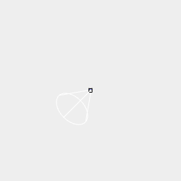

```JavaScript
await Arc(37).cut(inset(2)).ez(2).remesh(1).smooth(Box(50, 10, 20)).view();
```

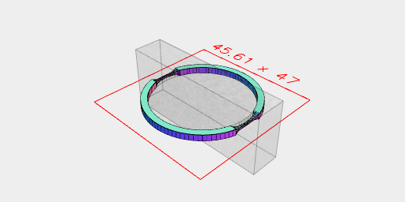

```JavaScript
await Box(4, 4, 4).cutOut(X(0)).view();
```

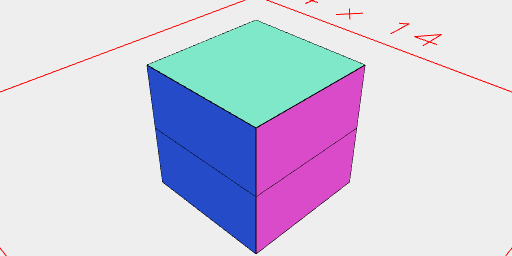

```JavaScript
await Box(4, 4, 4).cut('open', Box(2, 2, 8)).view();
```

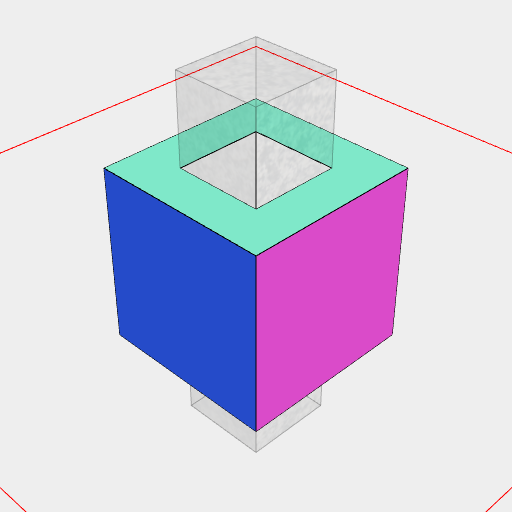

```JavaScript
await Box(4, 4, 4).clip('open', Box(2, 2, 8)).view();
```

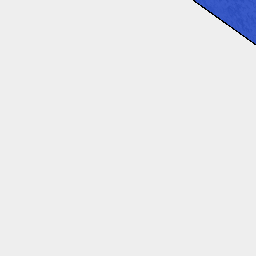

```JavaScript
await Loft(Box(3).cut(Arc(2)), Hexagon(3).cut(Arc(2)).z(10)).view();
```

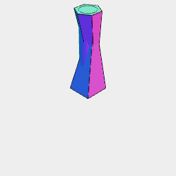

```JavaScript
await Loft('open', Box(3).cut(Arc(2)), Hexagon(3).cut(Arc(2)).z(10)).view();
```

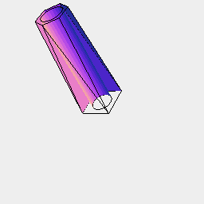

```JavaScript
await Orb(5, 5, 5, { zag: 5 })
  .eachEdge((e, l) => (s) => Box([0, 0.1], [0, 0.1], [0, l * 0.75]).to(e))
  .view();
```

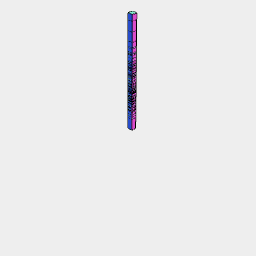

```JavaScript
await Box(4).fit(Arc(6).void()).ez(1).view();
```

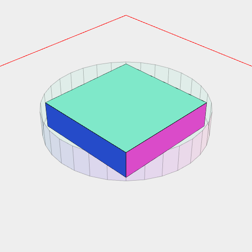

```JavaScript
await Box(4).fit(Arc(6).void()).ez(1, 'noVoid').view();
```

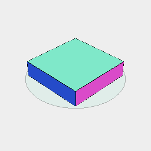

```JavaScript
await Box(4).fitTo(Arc(4).void()).cut(Hexagon(3)).clean().view();
```

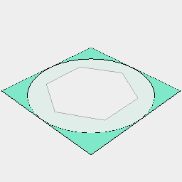

```JavaScript
await Box(4).fitTo(Arc(4).void()).cut(Hexagon(3), 'noVoid').clean().view();
```

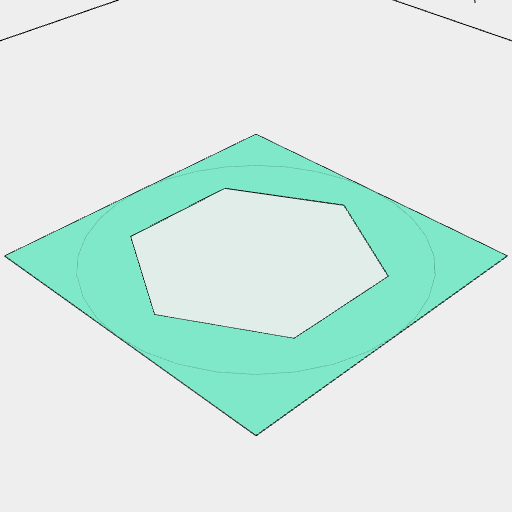

```JavaScript
await Box(4).fitTo(Arc(3).void()).join(Box(1, 5)).clean().view();
```

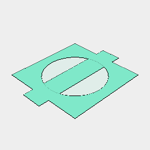

```JavaScript
await Box(4).fitTo(Arc(3).void()).join(Box(1, 5), 'noVoid').clean().view();
```

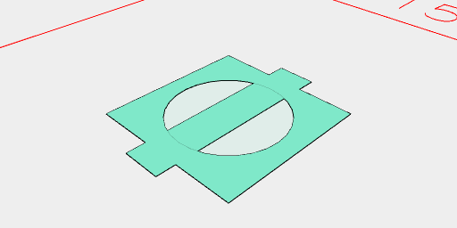

```JavaScript
await Box(4).fitTo(Arc(3).void()).clip(Box(1, 5)).clean().view();
```

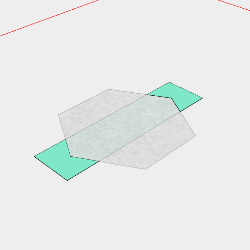

```JavaScript
await Box(4).fitTo(Arc(3).void()).clip(Box(1, 5), 'noVoid').clean().view();
```

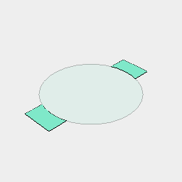

```JavaScript
await Box(10, 10, 10)
  .and(
    eachEdge((e, l) => (s) =>
      Box([0, 1.5], 0, [0, l])
        .and(
          Arc([1, 2], 1, [0, l * 0.95], { startTurn: 1 / 4, endTurn: 3 / 4 })
            .y(1)
        )
        .to(e)
    )
  )
  .view();
```

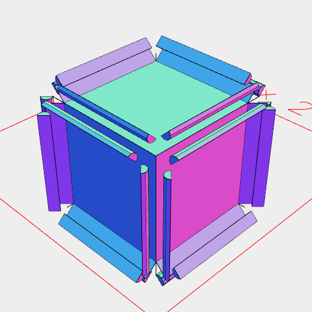

```JavaScript
await Arc(10, 10, 10, { sides: 7 })
  .cut(
    eachEdge({ selections: [Box(10, [-4, 10], [5, 10])] }, (e, l) => (s) =>
      Box(2, 2, [0, l])
        .clip(
          Arc(2, 2, [0, l], { start: 1/4, end: 3/4 })
            .grow(0.01)
        )
        .to(e)
    )
  )
  .clean()
  .view();
```

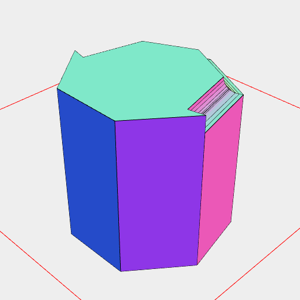
