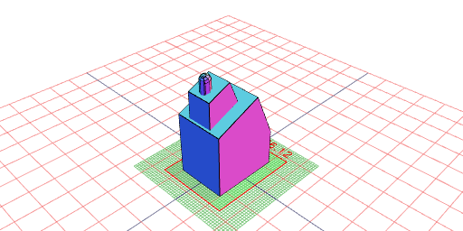
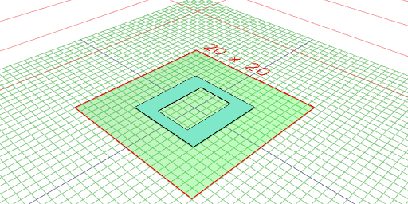
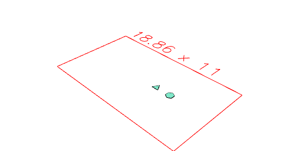
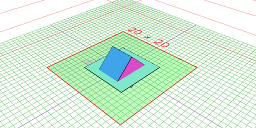
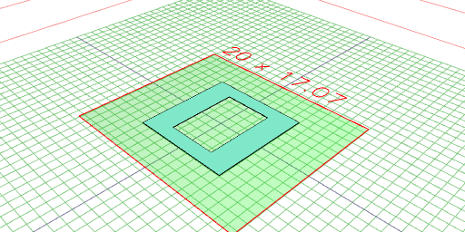

```JavaScript
Triangle(10)
  .color('red')
  .add(Box(5).color('blue'))
  .gridView(1);
```


```JavaScript
Box(5)
  .and(Arc(5))
  .gridView(2, { size: 800, triangles: false, outline: true, wireframe: false });
```


```JavaScript
Triangle(10)
  .color('red')
  .addTo(Box(5).color('blue'))
  .gridView(3);
```


```JavaScript
Box(5).by(align('x>y>')).gridView();
```


```JavaScript
Box(5)
  .as('box')
  .fitTo(Arc(4).as('arc'))
  .keep('box')
  .gridView(4);
```


```JavaScript
Box(5)
  .color('red')
  .clip(Arc(5.8).color('blue'))
  .gridView(5);
```


```JavaScript
Box(5)
  .color('red')
  .clipFrom(Arc(5.8).color('blue'))
  .gridView(6);
```


```JavaScript
Box(5).color('green').gridView();
```


```JavaScript
Box(5)
  .color('green')
  .colors((colors, s) => {
    md`Colors are ${colors}`;
    return s;
  });
```

Colors are

```JavaScript
Box(5)
  .color('red')
  .cut(Arc(6).color('blue'))
  .gridView(8);
```


```JavaScript
Box(5)
  .color('red')
  .cutFrom(Arc(6).color('blue'))
  .gridView(9);
```


```JavaScript
Assembly(Box(5), Arc(6))
  .each((leafs) => leafs[0])
  .gridView(10);
```

```JavaScript
Group(Box(5).color('red'), Arc(6).color('blue'))
  .fuse()
  .gridView(11);
```


```JavaScript
Box(10).inset(0.5, { step: 0.5 }).gridView(12);
```


```JavaScript
Assembly(Box(10).as('a'), Arc(6).as('b'))
  .keep('a')
  .gridView(13);
```


```JavaScript
Box(10)
  .material('copper')
  .gridView(14);
```


```JavaScript
Box(10).move(1, 2, 3).gridView(15);
```


```JavaScript
Box(10).moveTo(1, 2, 3).gridView(16);
```


```JavaScript
Box(10).move(1, 2, 3).moveTo(center()).gridView(17);
```


```JavaScript
Box(10).move(top()).gridView(18);
```


```JavaScript
Assembly(Box(5), Arc(5.5).void())
  .noVoid()
  .gridView(19);
```


```JavaScript
Box(5).offset(1).gridView(20);
```


```JavaScript
Box(5)
  .op(color('green'))
  .gridView(21);
```


```JavaScript
Line(10)
  .orient({ at: [40, 50, 0] })
  .gridView(22);
```


```JavaScript
Group(seq(Arc, { from: 1, to: 20 }))
  .pack()
  .gridView(23);
```


```JavaScript
Box(1, 2, 3).rx(1/8).gridView(25);
```


```JavaScript
Box(1, 2, 3).ry(1/8).gridView(26);
```


```JavaScript
Box(1, 2, 3).rz(1/8).gridView(27);
```


```JavaScript
Box(5).scale(1, 2).gridView(28);
```


```JavaScript
Box(5).cut(Arc(4.9).by(align('x>'))).scale(1, 1).gridView(29);
```


```JavaScript
Box(5).cut(Arc(4.9).by(align('x>'))).scale(-1, 1).gridView(30);
```


```JavaScript
Box(1, 2, 3)
  .size(size => shape => shape.md(`${JSON.stringify(size)}`));
```

{"length":1.0000000000000009,"width":2.0000000000000018,"height":3.0000000000000013,"max":[0.5000000000000008,1.0000000000000016,1.500000000000001],"min":[-0.5000000000000001,-1.0000000000000002,-1.5000000000000002],"center":[3.3306690738754696e-16,6.661338147750939e-16,4.440892098500626e-16],"radius":1.8708286933869718}

```JavaScript
Box(2, 2, 2)
  .color('red')
  .and(Box(1, 1, 1).sketch())
  .view(32);
```


```JavaScript
Box(1)
  .as('box')
  .tags((tags, shape) => {
    md`${tags}`;
    return shape;
  });
```

tags:

```JavaScript
Box(5, 5, 5).gridView(34);
```


```JavaScript
Box(5).tool('laser').gridView(35);
```


```JavaScript
Assembly(Box(5), Arc(6).void())
  .gridView(36);
```


```JavaScript
Box(5).fitTo(Arc(6)).gridView(38);
```


```JavaScript
Box(5).x(1).gridView(39);
```


```JavaScript
Box(5).y(1).gridView(40);
```


```JavaScript
Box(5).z(1).gridView(41);
```


```JavaScript
Arc(10).voidIn(offset(1)).ez(5).view(42);
```


```JavaScript
Box(10)
  .ez(10)
  .color('green')
  .and(faces().n(4).extrudeAlong(normal(), 1).tint('red'))
  .view(43);
```


```JavaScript
Arc(10).color('blue').color('red').view(44);
```


```JavaScript
Arc(10).color('blue').tint('red').view(45);
```


```JavaScript
Edges(
  seq((y) => [Point(-10, y, 0), Point(10, y, 0)], {
    from: -6,
    to: 6,
    by: 1 / 4,
  })
)
  .rz(1 / 8)
  .clip(Arc(5).cut(Arc(2)).ez(1, -1))
  .gridView(46);
```


```JavaScript
const b = Box(5)
  .ez(5)
  .and(
    Hershey('A', 3)
      .color('green')
      .z(5 / 2)
  )
  .material('glass')
  .y(10);
```

```JavaScript
Voxels([0, 0, 0], [0, 0, 1], [1, 0, 1], [2, 0, 1]).view(50);
```


```JavaScript
b.at(
  edges().sort('x<y<z>').n(0).origin(),
  cut(Box(11, 3, 3).rx(1 / 8))
).view(48);
```


```JavaScript
b.by(edges().sort('x<y<z>').n(0).origin())
  .cut(Box(11, 3, 3).rx(1 / 8))
  .view(49);
```


```JavaScript
Arc(2)
  .ez(5)
  .cut(Box(5).ry(1 / 16).ez(5).z(3))
  .simplify({ ratio: 0.1, eps: 0.01 })
  .view(51);
```


```JavaScript
Triangle(14).svg('triangle');
```


[triangle_0.svg](shape.triangle_0.svg)

```JavaScript
Box(10)
  .ez(50, -50)
  .rx(0, 1 / 4)
  .fuse().view(0)
  .remesh(1, Box(20, 20, 20))
  .smooth({ method: 'shape', iterations: 1, time: 1 }, Box(9, 20, 20))
  .view(53);
```


```JavaScript
Box(20, 20, 20)
  .view(1, { wireframe: true })
  .md('Original mesh')
  .remesh()
  .view(54, { wireframe: true })
  .md('Isotropic remeshing')
  .cut(Box([0, 10], [0, -10], [0, 10]))
  .view(55, { wireframe: true })
  .md('Cut')
  .demesh()
  .view(56, { wireframe: true })
  .md('Cleaned mesh');
```


Original mesh


Isotropic remeshing


Cut


Cleaned mesh

```JavaScript
Arc(4)
  .x(5)
  .seq({ by: 1 / 8 }, rz, Join)
  .material('glass')
  .color('orange')
  .and(toolpath())
  .view(57);
```


```JavaScript
Box(10)
  .cut(Arc(6).x(6, -6), Box(1, 10))
  .and(toolpath())
  .view(58);
```


```JavaScript
Box(20, 20, 20)
  .join(Box(10, 10, 40))
  .rx(1 / 16)
  .material('glass')
  .and(upperEnvelope().color('red'))
  .view(60);
```


Area of Box(2).cut(Box(1)) is 4.00

```JavaScript
Box(2).cut(Box(1)).area(v => s => s.md(`Area is ${v.toFixed(2)}`));
```

Area is 4.00

Area of Box(2, 3, 4) is 52.00

Volume of Box(2, 3, 4) is 24.00

```JavaScript
const c = Box(10)
  .rx(1 / 8)
  .view(67);
```


```JavaScript
c.by(origin()).view(68);
```


```JavaScript
c.by(origin(), and(Box(5, 5, 5))).view(69);
```


```JavaScript
c.by(origin(), cut(Box(5, 5, 5))).view(70);
```


```JavaScript
Triangle(4)
  .x(5)
  .at(origin(), rz(1 / 16))
  .view(71);
```



```JavaScript
Group(Box(), Triangle(1).x(2), Hexagon(1).x(4)).sort('x<3').view(72);
```



```JavaScript
Group(Box(), Triangle(1).x(2), Hexagon(1).x(4)).sort('x>1').view(73);
```



```JavaScript
Box(5, 5, 20)
  .rx(1 / 4, 1 / 32)
  .wrap(1, 0.1)
  .view(74);
```



```JavaScript
Box(100).image('https://jsxcad.js.org/png/cooper_2.png').log().topView(1);
```



```JavaScript
Segments([
  [
    [-18.15, 40.34, 0.0],
    [-9.82, 45.66, 0.0],
  ],
  [
    [-16.91, 42.17, 0.0],
    [13.92, 44.82, 0.0],
  ],
  [
    [-7.05, 43.82, 0.0],
    [26.69, 44.17, 0.0],
  ],
  [
    [10.87, 44.37, 0.0],
    [30.95, 42.04, 0.0],
  ],
  [
    [27.14, 44.17, 0.0],
    [36.46, 33.4, 0.0],
  ],
  [
    [32.65, 36.59, 0.0],
    [41.01, 31.89, 0.0],
  ],
  [
    [37.65, 36.13, 0.0],
    [41.54, 23.4, 0.0],
  ],
  [
    [41.8, 27.95, 0.0],
    [32.31, 22.32, 0.0],
  ],
  [
    [35.45, 27.34, 0.0],
    [32.49, 19.13, 0.0],
  ],
  [
    [35.49, 22.78, 0.0],
    [26.58, 16.06, 0.0],
  ],
  [
    [30.98, 18.21, 0.0],
    [22.45, 18.34, 0.0],
  ],
  [
    [25.05, 17.89, 0.0],
    [17.39, 24.13, 0.0],
  ],
  [
    [23.35, 20.63, 0.0],
    [-27.6, 21.31, 0.0],
  ],
  [
    [-21.39, 23.32, 0.0],
    [-28.85, 17.3, 0.0],
  ],
  [
    [-24.18, 19.16, 0.0],
    [-34.62, 18.52, 0.0],
  ],
  [
    [-31.34, 17.76, 0.0],
    [-38.2, 21.91, 0.0],
  ],
  [
    [-34.61, 21.3, 0.0],
    [-46.18, 22.21, 0.0],
  ],
  [
    [-43.37, 20.97, 0.0],
    [-42.86, 35.32, 0.0],
  ],
  [
    [-44.44, 28.39, 0.0],
    [-39.27, 34.39, 0.0],
  ],
  [
    [-41.93, 32.08, 0.0],
    [-17.37, 36.51, 0.0],
  ],
  [
    [-20.62, 35.14, 0.0],
    [-17.37, 41.56, 0.0],
  ],
])
  .fill()
  .topView();
```


