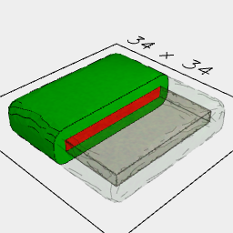
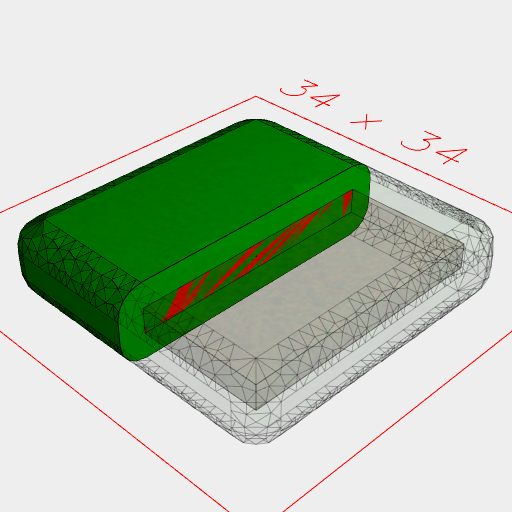
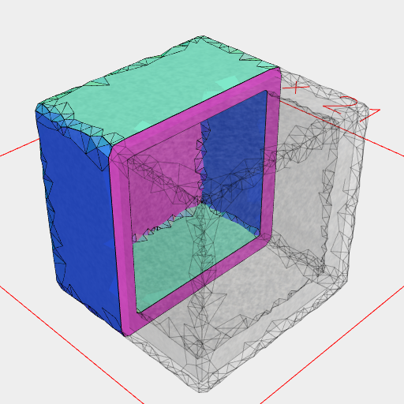
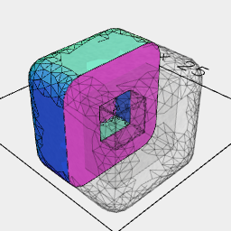
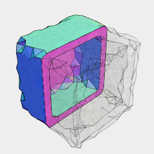
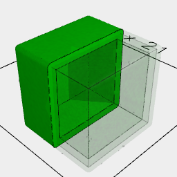
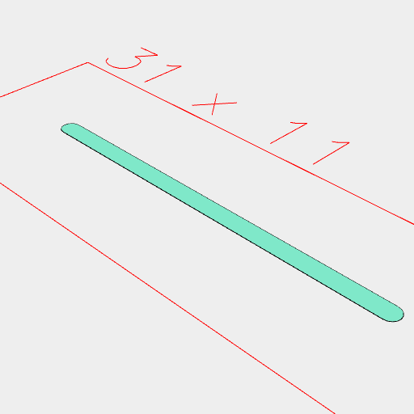
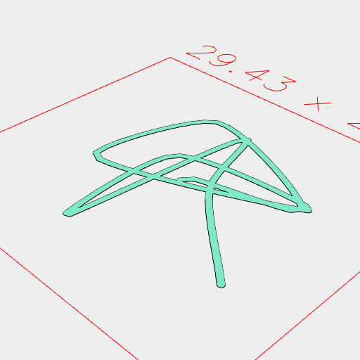
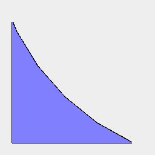
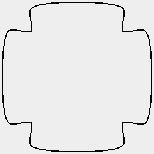

```JavaScript
Box(20)
  .ez(2)
  .clean()
  .And(color('red'), shell([2]).color('green'))
  .clip(YZ(0))
  .view();
```



```JavaScript
Box(20)
  .ez(2)
  .clean()
  .And(color('red'), shell([-1000000, 2], 'protect').color('green'))
  .clip(YZ(0))
  .view();
```



```JavaScript
Box(10, 10, 10).shell().clip(YZ()).view();
```



```JavaScript
Box(10, 10, 10).shell(5).clip(YZ()).view();
```



```JavaScript
Box(10, 10, 10).shell(1, { approx: 1 }).clip(YZ()).view();
```



```JavaScript
Box(10, 10, 10).shell(1, { approx: 0.01 }).clip(YZ()).color('green').view();
```



```JavaScript
Line(20).stroke(1).view();
```

```JavaScript
const Squiggle = (seed = 0, to = 10) =>
  Curve(
    Seq({ to }, (t) =>
      Point(random(seed).in(-10, 10)(t), random(seed + 1).in(-10, 10)(t))
    ),
    to * 10
  );
```



```JavaScript
Squiggle(1, 10).stroke(0.5).view(2);
```



```JavaScript
await Assembly(Box(5), Arc(5.5).gap()).noGap().gridView();
```



```JavaScript
Box(8, 12)
  .join(Box(12, 8))
  .And(points(), curve('closed', 200))
  .gridView();
```
