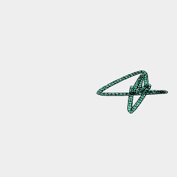

```JavaScript
Box(20)
  .ez(2)
  .clean()
  .And(color('red'), shell([2]).color('green'))
  .clip(YZ(0))
  .view();
```


```JavaScript
Box(20)
  .ez(2)
  .clean()
  .And(color('red'), shell([-1000000, 2], 'protect').color('green'))
  .clip(YZ(0))
  .view();
```


```JavaScript
Line(20).grow(Arc(1)).view();
```

```JavaScript
const Squiggle = (seed = 0, to = 10) =>
  Curve(
    Seq({ to }, (t) => random(2, t + seed * to, (x, y) => Point(10 * x, 10 * y))),
    to * 10
  );
```



```JavaScript
Squiggle(1, 10).grow(Arc(0.5)).view(2);
```


```JavaScript
await Assembly(Box(5), Arc(5.5).gap()).noGap().gridView();
```


```JavaScript
Box(8, 12)
  .join(Box(12, 8))
  .And(points(), curve('closed', 200))
  .gridView();
```


```JavaScript
Box(10)
  .and(Arc(plus(diameter(), 1)))
  .fill('holes')
  .view();
```


```JavaScript
Box(10)
  .and(Arc(times(diameter(), 3/4)))
  .fill('holes')
  .view();
```


```JavaScript
Box(10).x({ to: 100, by: 11 }).view();
```


```JavaScript
Box(10).rz({ by: 1/3 }).view();
```
