Arc(5).angle(45/360, 270/360)

```JavaScript
await Arc(5, { start: 45 / 360, end: 270 / 360 })
  .gridView()
  .md(`Arc(5).angle(45/360, 270/360)`);
```

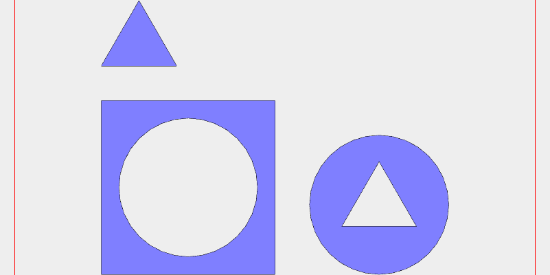

Assembly(Box(10), Arc(8), Triangle(5))

```JavaScript
await Assembly(Box(10), Arc(8), Triangle(5))
  .pack()
  .gridView(undefined, { size: 801, triangles: false, wireframe: false })
  .md(`Assembly(Box(10), Arc(8), Triangle(5))`);
```

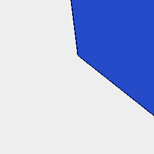

Box(5, 7, 8)

```JavaScript
await Box(5, 7, 8).view().md(`Box(5, 7, 8)`);
```

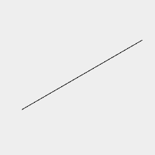

ChainHull(Point(), Box(5).z(5), Arc(3).z(8))

```JavaScript
await ChainHull(Point(), Box(5).z(5), Arc(3).z(8))
  .view()
  .md(`ChainHull(Point(), Box(5).z(5), Arc(3).z(8))`);
```

Empty()

```JavaScript
await Empty().view().md(`Empty()`);
```

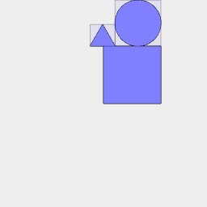

Group(Box(10), Arc(8), Triangle(5))

```JavaScript
await Group(Box(10), Arc(8), Triangle(5))
  .pack()
  .gridView()
  .md(`Group(Box(10), Arc(8), Triangle(5))`);
```

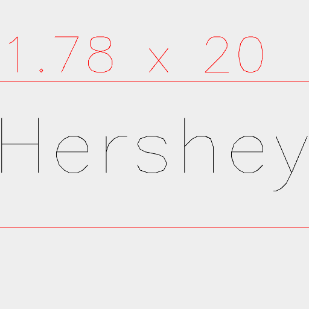

Hershey(10)('Hershey').align('xy')

```JavaScript
await Hershey('Hershey', 10)
  .align('xy')
  .gridView()
  .md(`Hershey(10)('Hershey').align('xy')`);
```

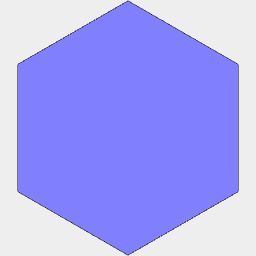

Hexagon(10)

```JavaScript
await Hexagon(10).gridView().md(`Hexagon(10)`);
```

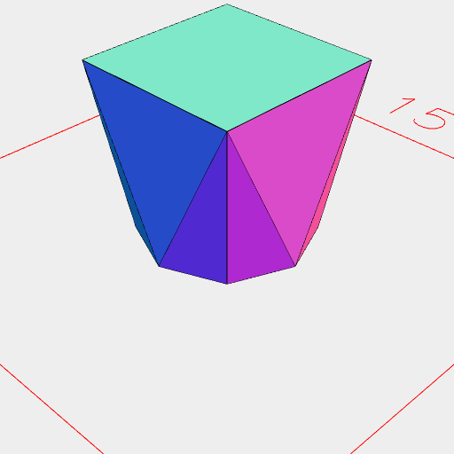

Hull(Arc(5), Box(5).z(5))

```JavaScript
await Hull(Arc(5), Box(5).z(5)).view().md(`Hull(Arc(5), Box(5).z(5))`);
```


Icosahedron(5)

```JavaScript
await Icosahedron(5).view().md(`Icosahedron(5)`);
```

```JavaScript
const torusFn = (x, y, z) => {
  const x2 = x * x,
    y2 = y * y,
    z2 = z * z;
  const x4 = x2 * x2,
    y4 = y2 * y2,
    z4 = z2 * z2;
  return (
    x4 +
    y4 +
    z4 +
    2 * x2 * y2 +
    2 * x2 * z2 +
    2 * y2 * z2 -
    5 * x2 +
    4 * y2 -
    5 * z2 +
    4
  );
};
```

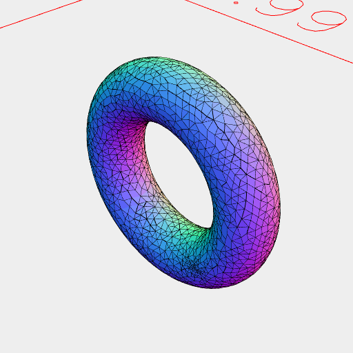

Implicit(2, torusFn

```JavaScript
await Implicit(2, torusFn).view({ withGrid: false }).md('Implicit(2, torusFn');
```


Line([5, -1])

```JavaScript
await Line([5, -1]).rz(45).gridView().md(`Line([5, -1])`);
```

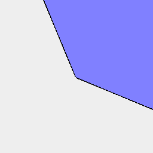

Octagon(5)

```JavaScript
await Octagon(5).gridView().md(`Octagon(5)`);
```

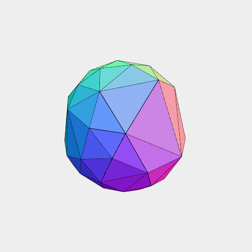

Orb(1)

```JavaScript
await Orb(1).view().md(`Orb(1)`);
```

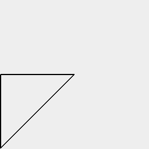

Link(Point(0), Point(5), Point(5, 5), Point(0)).rz(45 / 2)

```JavaScript
await Link(Point(0), Point(5), Point(5, 5), Point(0))
  .rz(45 / 2)
  .gridView()
  .md(`Link(Point(0), Point(5), Point(5, 5), Point(0)).rz(45 / 2)`);
```

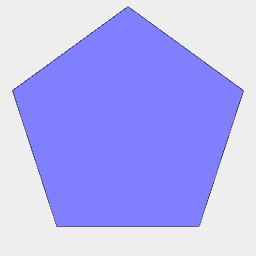

Pentagon(5)

```JavaScript
await Pentagon(5).gridView().md(`Pentagon(5)`);
```

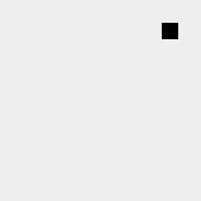

Point(0.5, 0.5)

```JavaScript
await Point(0.5, 0.5).gridView().md(`Point(0.5, 0.5)`);
```

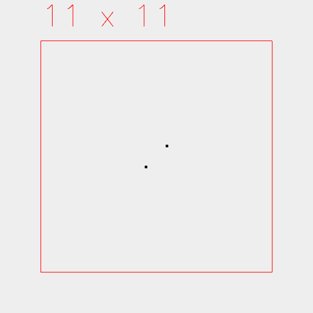

Points([0.5, 0.5], [-0.5, -0.5])

```JavaScript
await Points([0.5, 0.5], [-0.5, -0.5])
  .gridView()
  .md(`Points([0.5, 0.5], [-0.5, -0.5])`);
```

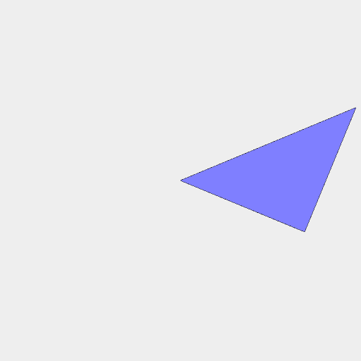

Polygon(Point(0), Point(5), Point(5, 5)).rz(1 / 16)

```JavaScript
await Polygon(Point(0), Point(5), Point(5, 5))
  .rz(1 / 16)
  .gridView()
  .md(`Polygon(Point(0), Point(5), Point(5, 5)).rz(1 / 16)`);
```

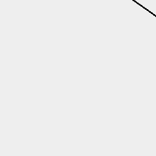

Polyhedron(  
      [[10, 10, 0], [10, -10, 0], [-10, -10, 0], [-10, 10, 0], [0, 0, 10]],  
      [[4, 1, 0], [4, 2, 1], [4, 3, 2], [4, 0, 3], [3, 0, 1], [3, 1, 2]])

```JavaScript
await Polyhedron(
  [
    [10, 10, 0],
    [10, -10, 0],
    [-10, -10, 0],
    [-10, 10, 0],
    [0, 0, 10],
  ],
  [
    [4, 1, 0],
    [4, 2, 1],
    [4, 3, 2],
    [4, 0, 3],
    [3, 0, 1],
    [3, 1, 2],
  ]
)
  .view()
  .md(
    `Polyhedron(  
      [[10, 10, 0], [10, -10, 0], [-10, -10, 0], [-10, 10, 0], [0, 0, 10]],  
      [[4, 1, 0], [4, 2, 1], [4, 3, 2], [4, 0, 3], [3, 0, 1], [3, 1, 2]])`
  );
```

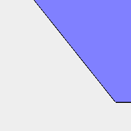

Septagon(5)

```JavaScript
await Arc(5, { sides: 7 }).gridView().md(`Septagon(5)`);
```


Spiral()

```JavaScript
await Spiral().gridView().md(`Spiral()`);
```

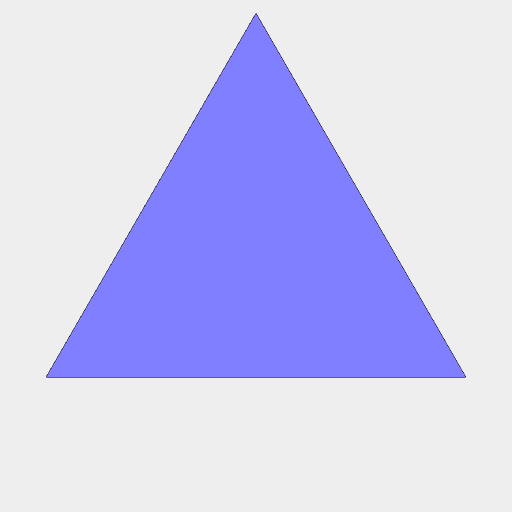

Triangle(5)

```JavaScript
await Triangle(5).gridView().md(`Triangle(5)`);
```

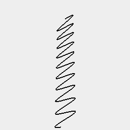

Wave((t) => Point(0, sin(t * 3) * 100), { to: 360 })

```JavaScript
await Wave((t) => Point(0, sin(t * 3) * 100), { to: 360 })
  .align('xy')
  .gridView()
  .md(`Wave((t) => Point(0, sin(t * 3) * 100), { to: 360 })`);
```

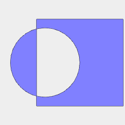

Group(Arc(5).x(-1), Box(5).x(1)).fill()

```JavaScript
await Group(Arc(4).x(-1), Box(5).x(1))
  .fill()
  .gridView()
  .md(`Group(Arc(5).x(-1), Box(5).x(1)).fill()`);
```

```JavaScript
const extentsA = [
  [2, 5],
  [2, 3],
  [2, 4],
];
```

```JavaScript
const extentsB = [
  [0, 1],
  [0, 5],
  [0, 5],
];
```

```JavaScript
const extentsC = [
  [-2, 2],
  [-2, 2],
  [-2, -1],
];
```


Boxes and Arcs from extents

```JavaScript
const q = await Group(
  ArcY(...extentsA).and(Box(...extentsA).material('glass')),
  ArcX(...extentsB).and(Box(...extentsB).material('glass')),
  ArcZ(...extentsC).and(Box(...extentsC).material('glass'))
).view().note(`Boxes and Arcs from extents`);
```

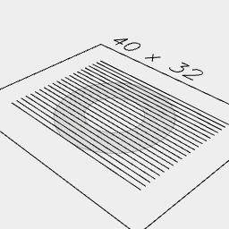

```JavaScript
await Line([15, -15])
  .seq({ from: -10, to: 11 }, y, Group)
  .clip(Arc(20).cut(Arc(10)))
  .view();
```

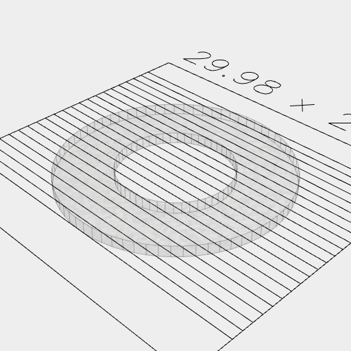

```JavaScript
await Line([15, -15])
  .seq({ from: -10, to: 11 }, y, Group)
  .clip(Arc(20).cut(Arc(10)).ez([1]))
  .view();
```

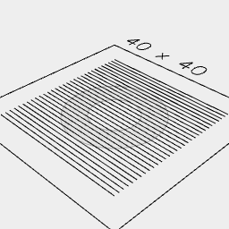

```JavaScript
await Line([-15, 15])
  .seq({ from: -15, to: 15 }, y, Group)
  .cut(Arc(20).cut(Arc(10)))
  .view();
```

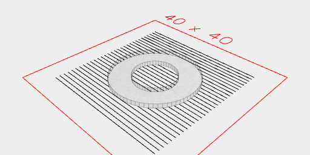

```JavaScript
await Line([-15, 15])
  .seq({ from: -15, to: 15 }, y, Group)
  .cut(Arc(20).cut(Arc(10)).ez([1]))
  .view();
```

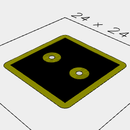

```JavaScript
await Box(12)
  .cut(
    Arc(3)
      .y(3)
      .rz(1 / 4, 3 / 4)
  )
  .color('black')
  .fit(separate().offset(1).fuse().color('yellow'))
  .view();
```

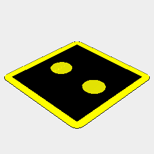

```JavaScript
await Box(12)
  .cut(
    Arc(3)
      .y(3)
      .rz(1 / 4, 3 / 4)
  )
  .color('black')
  .fit(separate('noHoles').offset(1).fuse().color('yellow'))
  .view();
```

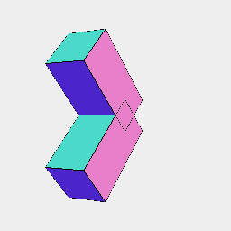

```JavaScript
await Group(Box(1), Box(1).rx(1 / 4))
  .each(e([2]))
  .view();
```

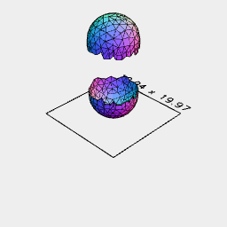

```JavaScript
await Orb(10)
  .op(lowerEnvelope().ez([-1]).z(-5), upperEnvelope().ez([1]).z(5))
  .align('z>')
  .view(1);
```

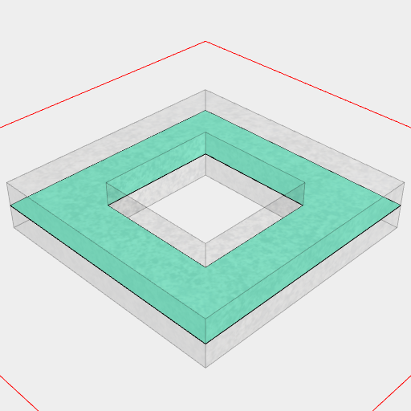

```JavaScript
await Box(10).cut(Box(5)).ez([1, -1]).section().view();
```

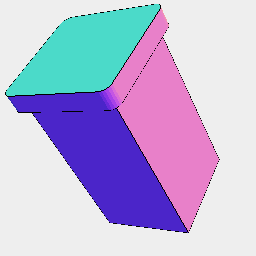

```JavaScript
await Box(10, 10, 20)
  .cutOut(Box(20, 20, [8, 100]), noOp(), grow(2, 'xy'))
  .view();
```

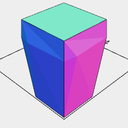

```JavaScript
await Box(10, 10, 20)
  .grow(2, Box(10, 10, [7, 10]))
  .view(3);
```

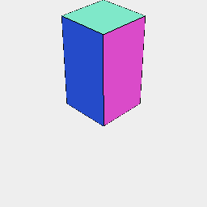

```JavaScript
await Box(10, 10, 20)
  .seam(Box(10, 10, [6, 11]))
  .grow(1, Box(10, 10, [7, 10]))
  .view(3, rx(1 / 2).align('z>'));
```

```JavaScript
const red = await Arc(2).color('red');
```

```JavaScript
const blue = await Box(10).x(10).color('blue');
```

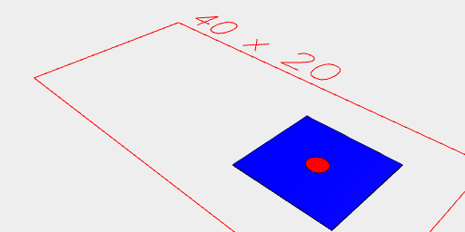

```JavaScript
await blue.fitTo(red.to(blue)).view();
```

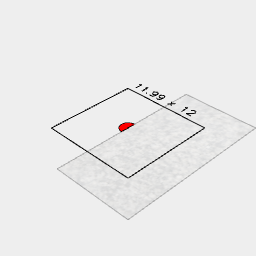

```JavaScript
await red.at(blue, cut(Box([10, 20], 20))).view();
```

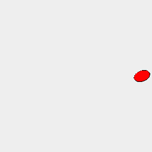

```JavaScript
await red.by(blue).view();
```

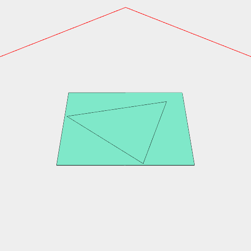

```JavaScript
await Box(5)
  .as('b')
  .and(Triangle(5).as('t'))
  .on(get('b'), rz(1 / 8))
  .view();
```


```JavaScript
await Box(10).cut(Box(5, 50, 5)).view();
```

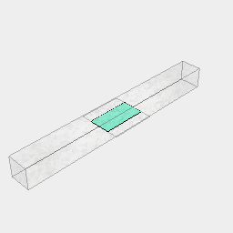

```JavaScript
await Box(10).clip(Box(5, 50, 5)).view();
```

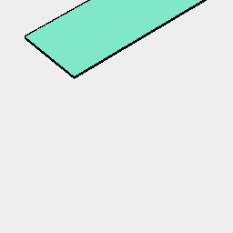

```JavaScript
await Box(10).join(Box(5, 50, 5)).view();
```

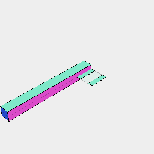

```JavaScript
await Box(10).and(Box(5, 50, 5)).disjoint().pack().view();
```

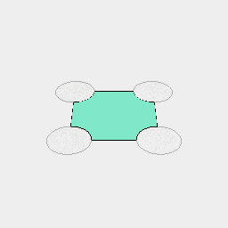

```JavaScript
await Box(10)
  .rz(1 / 8)
  .cut(eachPoint(Arc(5).to))
  .view();
```

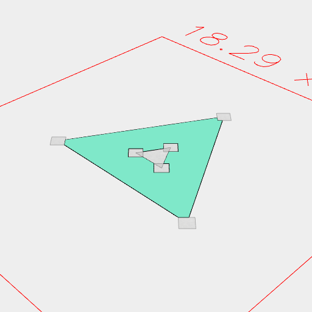

```JavaScript
await Triangle(10)
  .cut(inset(2))
  .cut(eachPoint(Arc(1).to))
  .view();
```

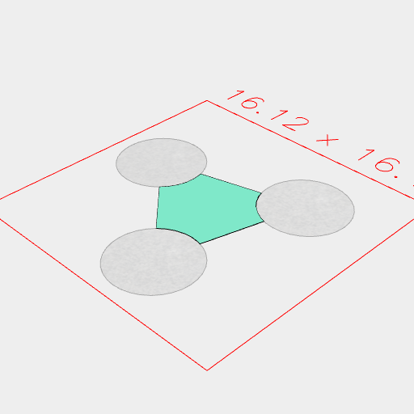

```JavaScript
await Triangle(10)
  .cut(inset(4))
  .rz(1 / 8)
  .cut(eachPoint(Arc(5).to))
  .view();
```

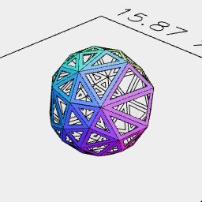

```JavaScript
await Orb(6, { zag: 2 })
  .faces(cut(inset(0.2)))
  .view();
```

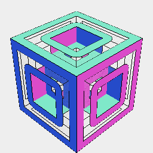

```JavaScript
await Box(10, 10, 10)
  .cut(faces(Box(4, 4, 4).to))
  .faces(cut(inset(1)))
  .view();
```

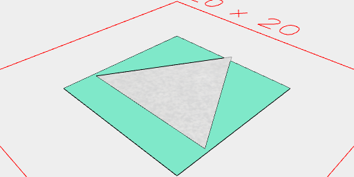

```JavaScript
await Box(10).cut(Triangle(11)).view(1);
```

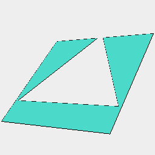

```JavaScript
await Box(10).cut(Triangle(11)).clean().view(2);
```

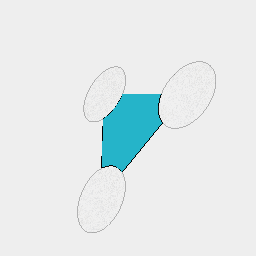

```JavaScript
await Triangle(11).eachPoint(Arc(5).to, cut).view(5);
```

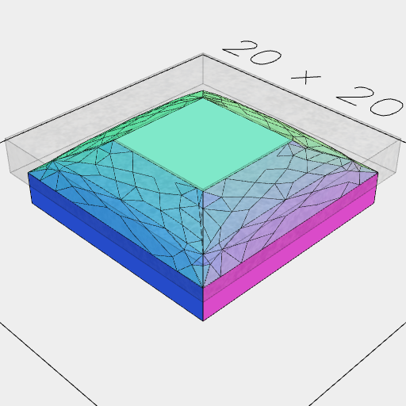

```JavaScript
await Box(10, 10, [0, 3])
  .smooth(1, Box(11).cut(Box(5)).ez([1.5, 3.1]), { iterations: 1, time: 1 })
  .view();
```

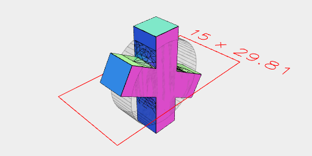

```JavaScript
await Box(5, 5, 20)
  .rx(0 / 4, 1 / 6)
  .fuse()
  .smooth(1, ArcX(5, 16, 16))
  .view();
```

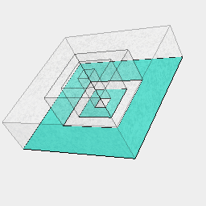

```JavaScript
await Box(10)
  .cut(Box(5).cut(Box(3).cut(Box(1))))
  .ez([3])
  .section()
  .view();
```


```JavaScript
Curve([0, 12], [1, 12], [5, 10], [12.5 + 5, 0], [16, -12], [21, -12])
  .color('red')
  .Link(link('reverse'), sx(-1))
  .stroke(1)
  .view();
```
