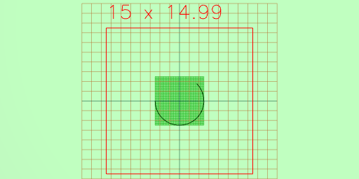

Arc(5).angle(45/360, 270/360)

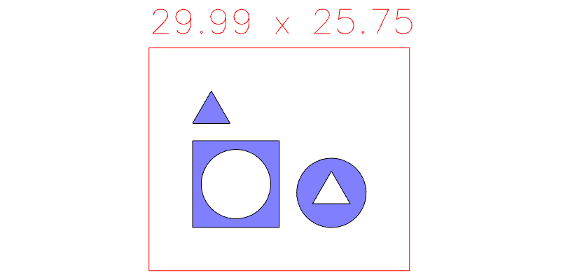

Assembly(Box(10), Arc(8), Triangle(5))

Box(5, 7, 8)

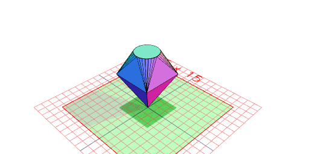

ChainedHull(Point(), Box(5).z(5), Arc(3).z(8))

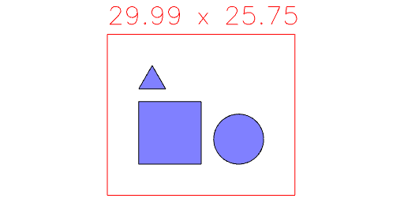

Cone(6, 3)

Empty()

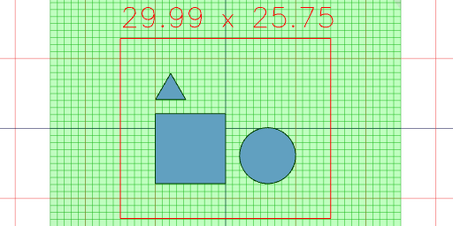

Group(Box(10), Arc(8), Triangle(5))

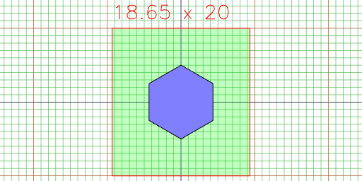

Hershey(10)('Hershey').align('xy')

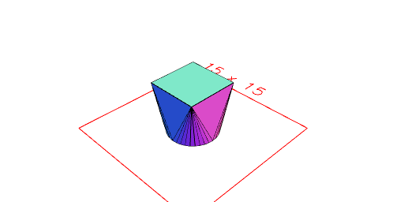

Hexagon(10)

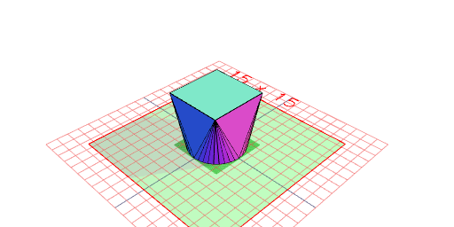

Hull(Arc(5), Box(5).z(5))

Icosahedron(5)

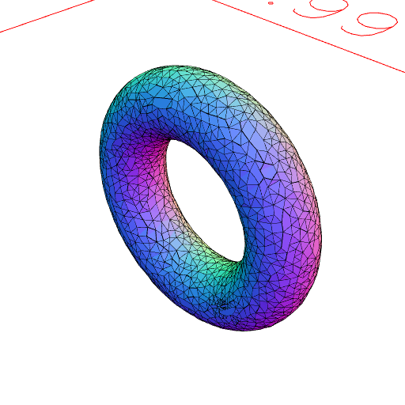

Line(5, -1)

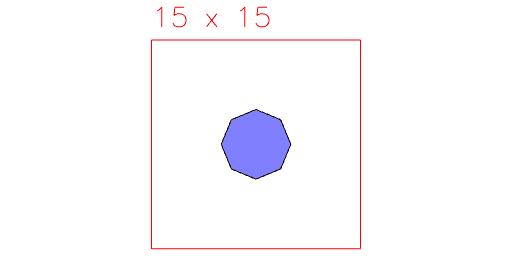

Octagon(5)

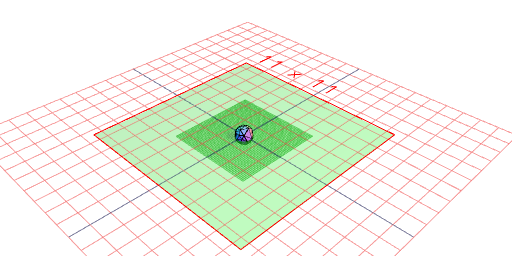

Orb(5)

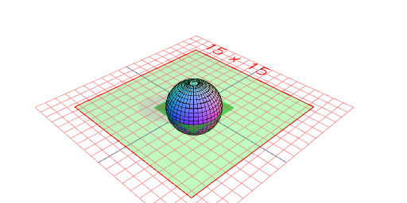

Path(Point(0), Point(5), Point(5, 5), Point(0)).rz(45 / 2)

Pentagon(5)

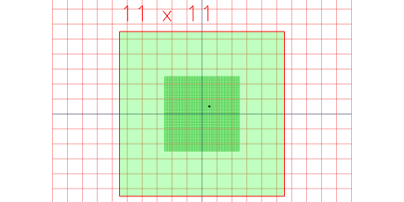

Point(0.5, 0.5)

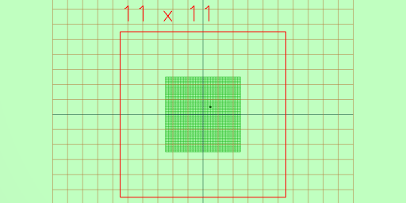

Points([0.5, 0.5], [-0.5, -0.5])

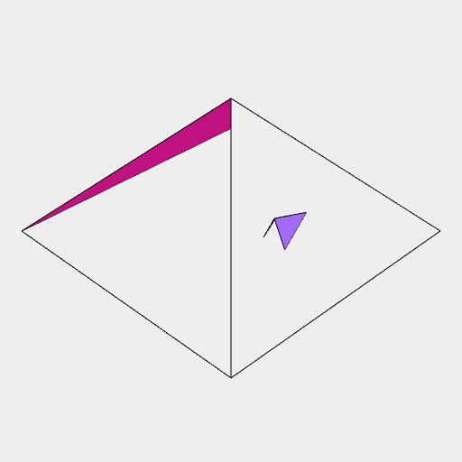

Polygon(Point(0), Point(5), Point(5, 5)).rz(1 / 16)

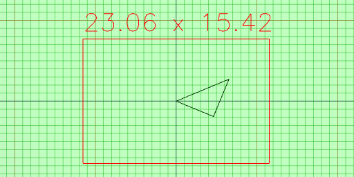

Polyhedron(  
      [[10, 10, 0], [10, -10, 0], [-10, -10, 0], [-10, 10, 0], [0, 0, 10]],  
      [[4, 1, 0], [4, 2, 1], [4, 3, 2], [4, 0, 3], [3, 0, 1], [3, 1, 2]])

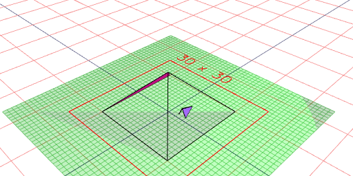

Septagon(5)

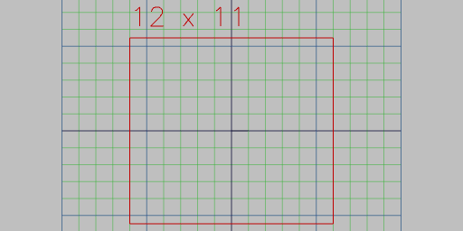

Spiral()

Tetragon(5)

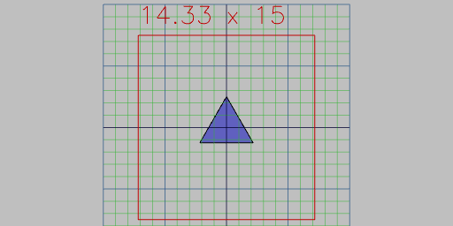

Triangle(5)

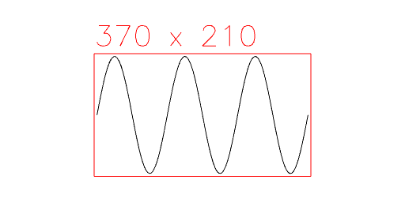

Wave((a) => [[0, sin(a * 3) * 100]], { to: 360 })

Weld(Arc(5).x(-1), Box(5).x(1)).fill()
