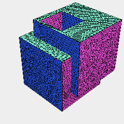
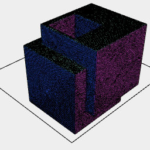
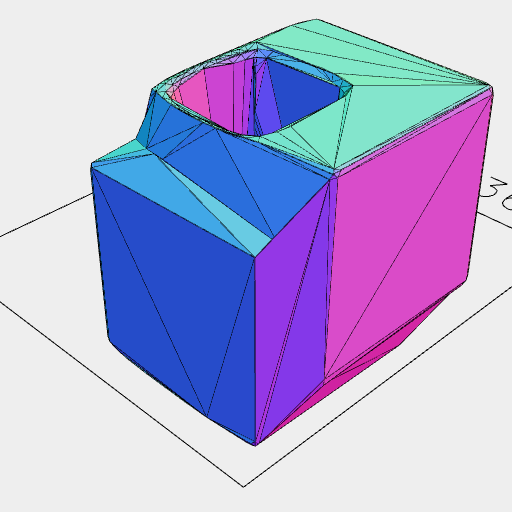

fused

```JavaScript
const fused = await Box(20, 20, 20)
  .move([0, 0], [3, 4, 6])
  .cut(Box(10, 10, 100))
  .fuse()
  .view(1)
  .note('fused');
```



remeshed

```JavaScript
const remeshed = await fused.remesh().view(1, 'wireframe').note('remeshed');
```



smoothed

```JavaScript
const smoothed = await remeshed.smooth().view(1).note('smoothed');
```



simplified

```JavaScript
const simplified = await smoothed.simplify().view(1).note('simplified');
```
