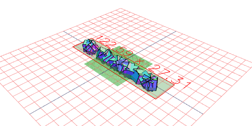
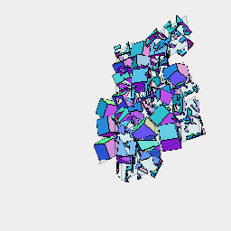
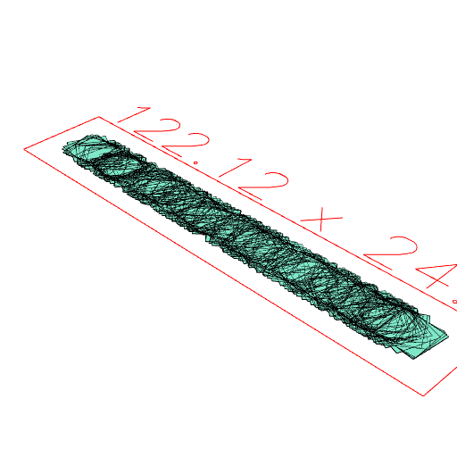
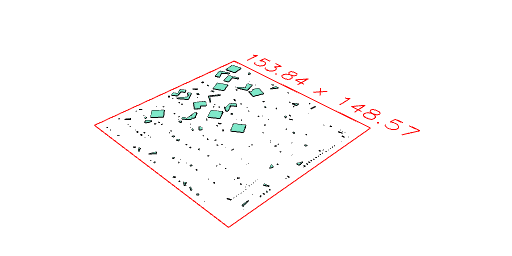

```JavaScript
const r = Random();
```

```JavaScript
Box(10, 10, 10).seq({ to: 32 }, (t) => (s) => s.ry(r.in(0, 1)).rz(r.in(0, 1)).x(r.in(-50, 50)), Group).view(1).disjoint().pack().view(2);
```





```JavaScript
Box(10).seq({ to: 256 }, (t) => (s) => s.rz(r.in(0, 1)).x(r.in(-50, 50)), Group).view(1).disjoint().pack().view(2);
```




