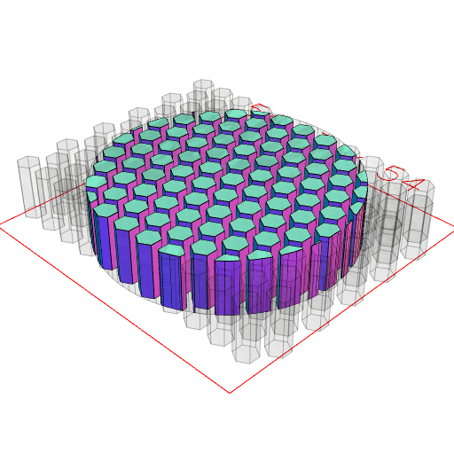

```JavaScript
Hexagon(4)
  .seq(
    { to: 10 },
    { to: 10 },
    (x, y) => (s) => s.move(x * 5 + (y % 2) * 2.5, y * 4),
    Group
  )
  .by(align('xy'))
  .ez(10)
  .clip(Arc(45).ez(10))
  .view();
```


