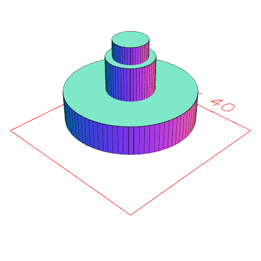
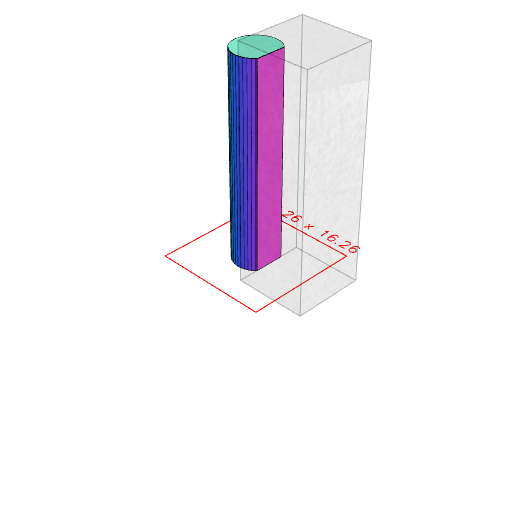
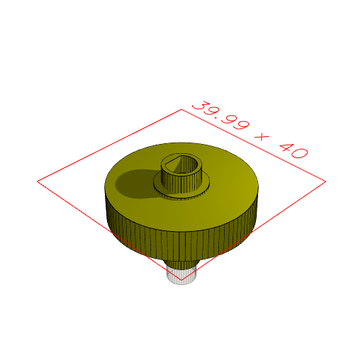
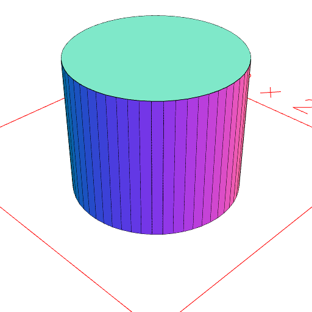
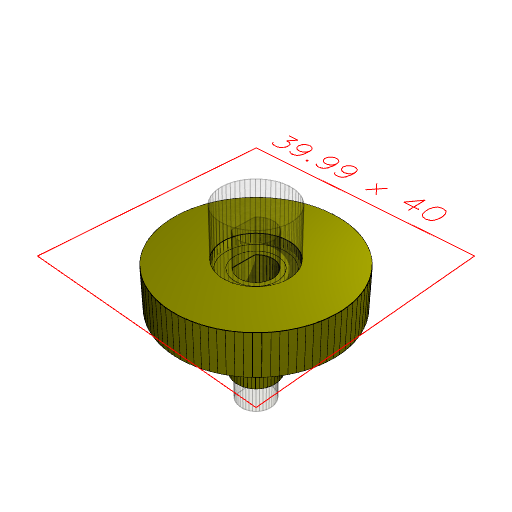

```JavaScript
const core = Group(
  Arc(11).ez(15.5).z(4),
  Arc(7.85).ez(23.5),
  Arc(30).ez(7).z(4.5)
).view();
```



```JavaScript
const center = Arc(6.26).ez(28.5).cut(Box(10, 10).ez(31.5).x(7.3)).view();
```



```JavaScript
const base = core
  .cut(center)
  .ry(1 / 2)
  .color('olive')
  .z(4)
  .tag('gear')
  .view();
```



```JavaScript
const grabber = Arc(12).ez(10).z(-2).view();
```



```JavaScript
const final = base.cut(grabber).stl('test shape.stl');
```



[test shape.stl_0.stl](thing.test%20shape.stl_0.stl)
