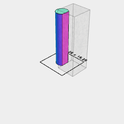
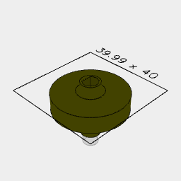
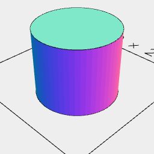
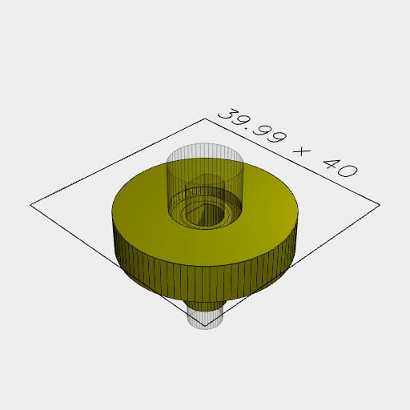

```JavaScript
const core = await Group(
  Arc(11).ez([15.5]).z(4),
  Arc(7.85).ez([23.5]),
  Arc(30).ez([7]).z(4.5)
).view();
```


```JavaScript
const center = await Arc(6.26).ez([28.5]).cut(Box(10, 10).ez([31.5]).x(7.3)).view();
```



```JavaScript
const base = await core
  .cut(center)
  .ry(1 / 2)
  .color('olive')
  .z(4)
  .tag('gear')
  .view();
```



```JavaScript
const grabber = await Arc(12).ez([10]).z(-2).view();
```



```JavaScript
const final = await base.cut(grabber).stl('test shape.stl');
```



[test shape.stl.stl](thing.test%20shape.stl.stl)
