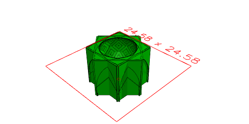

```JavaScript
Box(10)
  .ez(10)
  .color('green')
  .cut(
    Arc(10)
      .x(5)
      .ez(15, -10)
      .ry(1 / 8)
  )
  .and((s) => s.centroid().color('yellow').sketch())
  .and((s) => s.normal().color('red').sketch())
  .op((s) => s.moveTo(...s.centroid().toPoints()[0]))
  .rz(seq((a) => a, { by: 1 / 8, upto: 1 }))
  .view();
```


