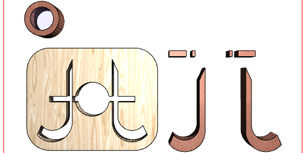

# Jot (JSxCAD)

Press Shift-Enter to save and regenerate notebook.

Press Control-E to cycle between editing and viewing a notebook.

## Links

1. [Documentation](#https://raw.githubusercontent.com/jsxcad/JSxCAD/master/nb/documentation/index.nb)
1. [API](#https://raw.githubusercontent.com/jsxcad/JSxCAD/master/nb/api/index.nb)
1. [Regression](#https://raw.githubusercontent.com/jsxcad/JSxCAD/master/nb/regression/regression.nb)
1. [Projects](#https://raw.githubusercontent.com/jsxcad/JSxCAD/master/nb/projects/index.nb)

## Introduction

Jot allows CAD design as notebooks.

```JavaScript
Assembly(
  Box(15, 10).offset(4).material('wood').ez(2).as('base'),
  Box(15, 1).material('copper').ez(2.5).as('bar'),
  Box(10, 20)
    .material('copper')
    .cut(Arc(5).y(-3).hull(self(), Line(-2.5, 2.5).y(5)))
    .clip(Arc(7).y(-4).hull(self(), Line(-3.5, 3.5).y(7)))
    .clip(loop(Point(3.5, 7), Point(3.5, -8), Point(-3.5, -8)).fill())
    .op(
      x(-7).ez(3),
      ry(1 / 2)
        .x(7)
        .ez(3)
    )
    .as('j-and-t'),
  Arc(6).material('copper').fitTo(inset(1).void()).ez(3).as('o')
)
  .scale(3)
  .ry(0 / 32)
  .clean()
  .topView(1)
  .each(to(XY()))
  .pack()
  .y(-45)
  .by(align('xy'))
  .topView(2);
```




Clicking on a view maximizes and allows rotation and animation; use Escape to return.

## Navigation

You can Control-Click on a link in the editor to visit a page.

'''
import 'https://raw.githubusercontent.com/jsxcad/JSxCAD/master/nb/examples.nb';
'''

You can click on links in a notebook, like so: [examples.nb](#JSxCAD@https://raw.githubusercontent.com/jsxcad/JSxCAD/master/nb/examples.nb)

The back button should return as usual, and urls can be bookmarked normally.

## Stability

Please understand that JSxCAD is undergoing rapid evolution, and the API is not stable.

You will soon be able to select particular commits to work at to mitigate this somewhat.

## Supported Browsers

Only the latest version of chromium is supported at this time.

Other browsers may or may not work, and fixes to support them are a low priority.

This should change as JSxCAD becomes more mature.

## Data Storage

Edits are stored locally in the browser - they can be downloaded or published only explicitly.

* Control-S will save local edits in the browser.
* Shift-Enter will save, then run the notebook being edited.
