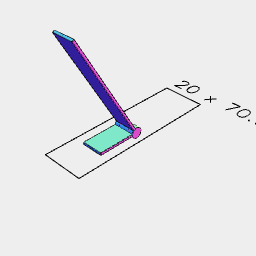
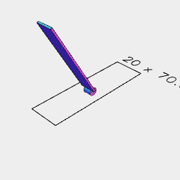
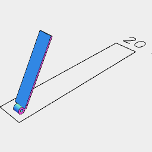
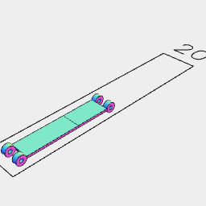
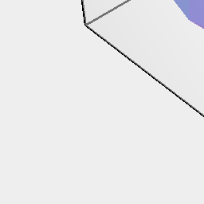
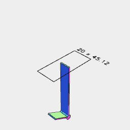

```JavaScript
const joint = Joint(
  60,
  20,
  Box(10, 1, [2.5, 60]).join(ArcX(5, 5, 5)).and(ArcX(5, 2, 2).gap()),
  Box(10, 1, [2.5, 20])
    .join(ArcX([-5, -2.5], 5, 5), ArcX([5, 2.5], 5, 5))
    .and(ArcX(10, 2, 2).gap())
)
  .on(get('arm'), rx(90 / 360))
  .on(get('base'), rx(30 / 360))
  .view();
```

```JavaScript
const Joint = (
  baseLength = 30,
  armLength = 30,
  base = Group(),
  arm = Group()
) =>
  And(
    And(Ref('hinge'), base, Ref('end').z(baseLength)).as('base'),
    And(Ref('hinge'), arm, Ref('end').z(armLength)).as('arm')
  );
```




[base.stl](test.base.stl)



[arm_base.stl](test.arm_base.stl)



[arm_arm.stl](test.arm_arm.stl)

```JavaScript
joint
  .on(
    get('arm').in().get('end'),
    and(
      Joint(
        50,
        30,
        Box(10, 1, [2.5, 50]).join(ArcX(5, 5, 5)).and(ArcX(5, 2, 2).gap()),
        Box(10, 1, [2.5, 30])
          .join(ArcX([-5, -2.5], 5, 5), ArcX([5, 2.5], 5, 5))
          .and(ArcX(10, 2, 2).gap())
      )
        .on(get('arm'), rx(-60 / 360))
        .to(origin(), get('arm').in().get('end'))
        .rx(1 / 2)
    )
  )
  .view()
  .stl('base', get('base').disjoint())
  .stl('arm_base', get('arm').in().get('base').disjoint())
  .stl('arm_arm', get('arm').in().getNot('base').disjoint())

  .v(1);
```


```JavaScript
const j2 = joint
  .on(
    joint.get('arm').in().get('end'),
    and(To(joint, get('arm').in().get('end')))
  )
  .view()
  .v(2);
```



```JavaScript
Joint(40, 40)
  .on(get('base').in().get('end'), and(Box(30)))
  .view();
```



```JavaScript
const b = joint.flat(get('base').in().get('end')).view().v(2);
```
