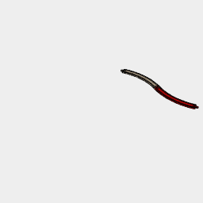
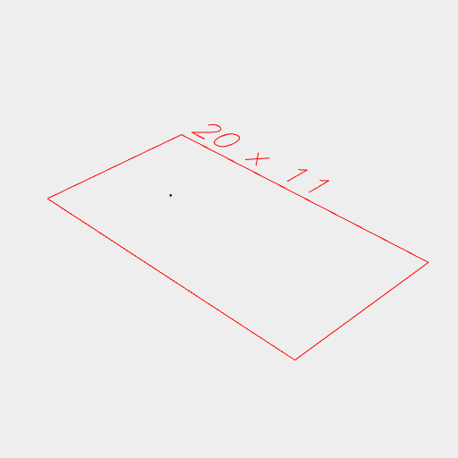

[index](../../nb/api/index.md)
### Arc()
Parameter|Default|Type
---|---|---
...dimensions|[1, 1, 1]|The size of the bounding box of the arc.

Produces an arc z axis within the dimensions provided.

Arc is equivanent to ArcZ.

See: [ArcX](../../nb/api/ArcX.nb), [ArcY](#https://raw.githubusercontent.com/jsxcad/JSxCAD/master/nb/api/ArcY.nb), [ArcZ](#https://raw.githubusercontent.com/jsxcad/JSxCAD/master/nb/api/ArcZ.md).


Dimensions may be ranges.

```JavaScript
Group(Arc(4), Arc(4, [3, 4]))
  .view(1)
  .note('Dimensions may be ranges.');
```



Three dimensions are supported.

```JavaScript
Arc(4, 5, 6).view().note('Three dimensions are supported.');
```



Angle constraints can be supplied to produce open arcs.

```JavaScript
Arc(4, { start: 1 / 16, end: 15 / 16 })
  .view()
  .note('Angle constraints can be supplied to produce open arcs.');
```


Points are ordered to allow loops.

```JavaScript
Arc(4, { start: 1 / 16, end: 15 / 16 })
  .and(Point())
  .loop()
  .fill()
  .view()
  .note('Points are ordered to allow loops.');
```


We can also specify arcs in terms of apothem.

```JavaScript
await Arc(10)
  .and(Arc(10, { sides: 5 }))
  .and(Arc({ apothem: 10, sides: 5 }))
  .outline()
  .topView(1)
  .note('We can also specify arcs in terms of apothem.');
```
