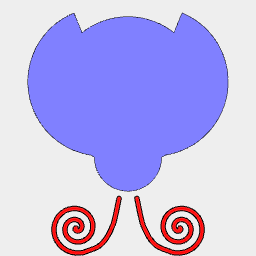

```JavaScript
const TILT = 3 / 48;
```



```JavaScript
const bug = And(
  Arc(20, { end: 1 / 2 })
    .loop()
    .fill()
    .as('wing')
    .and(
      Group(
        Arc(2).x(1.6).y(0.5),
        Arc(3).x(2.5).y(-3.8),
        Arc(2).x(1.7).y(-8),
        Arc(2.3).x(5).y(-0.8),
        Arc(2.3).x(5).y(-6.5),
        Arc(2).x(7.25).y(-3.5),
        Arc(2.2).x(8).y(1.2),
        Arc(3).x(5.5).y(3.5),
        Arc(2.3).x(1.8).y(5.8),
        Arc(2).x(4.5).y(7)
      )
        .color('black')
        .as('spots')
    )
    .rz(TILT)
    .y(6.25)
    .x(3.5)
    .sx(1, -1),
  Arc(9).y(-4).as('head'),
  Arc(20).as('body').y(5),
  Link(
    Spiral({ by: 1 / 32, to: 2.3 })
      .scale(1.5)
      .y(-13.5)
      .x(7),
    Curve([6, -16.8], [4, -16], [3, -15], [2, -13], [1.2, -9.5])
  )
    .grow(Arc(0.6))
    .fuse()
    .as('antenna')
    .color('red')
    .sx(1, -1)
)
  .view('top')
  .and(get('head', 'body', 'wing').offset(1).fuse().as('shell').color('green'))
  .rz(1 / 2)
  .svg('ladybird_body', get('shell', 'antenna').fuse().outline())
  .svg('ladybird_wings', get('wing', 'spots').outline())
  .v(5);
```
